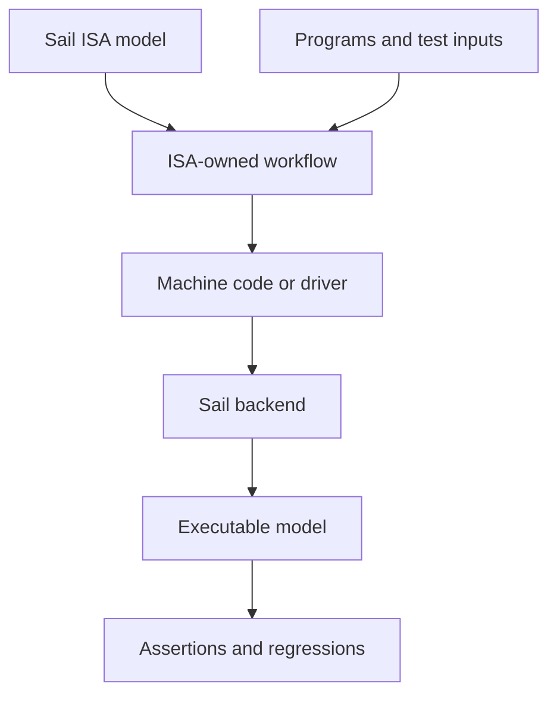

# verylogic Sail ISA Workspace

[中文](README.zh-CN.md) · [Documentation](https://vidlg.github.io/verylogic-workspace-sail/) · [MDX source](site/docs/en/index.mdx)

An educational workspace for specifying, executing, and testing instruction-set architectures with [Sail](https://github.com/rems-project/sail). Each ISA is an independent module with its own model, programs, tools, and tests; Rspress publishes the accompanying tutorials and implementation guides as a bilingual MDX site.

## Start here

| Goal | Entry point |
| --- | --- |
| Run the Hack model | [Quick start](#quick-start) |
| Understand why the workspace uses Sail | [Why Sail](https://vidlg.github.io/verylogic-workspace-sail/why-sail) |
| Learn Hack and Sail | [Hack tutorial](https://vidlg.github.io/verylogic-workspace-sail/hack/tutorial) |
| Study instruction semantics | [Hack ISA](https://vidlg.github.io/verylogic-workspace-sail/hack/isa) |
| Understand the assembler and executor | [Hack documentation](https://vidlg.github.io/verylogic-workspace-sail/hack/) |
| Work inside the Hack package | [`isa/hack/README.md`](isa/hack/README.md) |
| Add another ISA | [Adding an ISA](#adding-an-isa) |

## Why Sail

An ISA is the software-visible contract of a processor: instruction encodings, architectural state, and the state transition produced by each instruction. Sail lets one model serve as a readable specification, an executable implementation, and input to code-generation and formal-tool backends. The documentation's [Why Sail guide](https://vidlg.github.io/verylogic-workspace-sail/why-sail) compares that role with prose, C/C++, Verilog/SystemVerilog, ad hoc models, and proof assistants—and explains when those alternatives remain the better tool.

This workspace adds the module-specific pieces needed to teach and test an ISA end to end:



## Quick start

Install [Pixi](https://pixi.sh/latest/installation/), then run from the repository root:

```sh
pixi run just install
pixi run sail --version
pixi run just hack list
pixi run just hack run multiply
```

A successful Hack program prints `ASSERT PASS` followed by its final architectural state. Continue with the [Hack tutorial](https://vidlg.github.io/verylogic-workspace-sail/hack/tutorial) to inspect the source, machine code, generated Sail driver, and assertions.

Run all repository tests with:

```sh
pixi run just test
```

## ISA modules

| ISA | Model | Documentation | Package reference |
| --- | --- | --- | --- |
| Hack | nand2tetris 16-bit teaching ISA | [Tutorial and internals](https://vidlg.github.io/verylogic-workspace-sail/hack/) | [`isa/hack`](isa/hack/README.md) |

Module commands use a common outer shape:

```text
pixi run just <isa> <action> [program]
```

Modules expose the actions that make sense for their toolchain:

| Action | Purpose |
| --- | --- |
| `list` | List runnable examples |
| `check` | Type-check the Sail model |
| `assemble` | Produce machine code or another ISA-specific artifact |
| `run` | Execute one example |
| `test` | Run the module regression suite |
| `clean` | Remove generated artifacts |

The action names are consistent; assemblers, loaders, drivers, metadata, and execution strategies remain ISA-specific.

## Platforms and dependencies

Pixi supplies Python, Pytest, Just, GMP, Node.js 22, and the host C compiler. The project installs Sail `0.20.2` under the Git-ignored `.pixi/sail/` directory and does not depend on an arbitrary system Sail executable.

Supported hosts:

- Windows AMD64;
- Linux x86_64;
- Linux aarch64.

Sail `0.20.2` has no official macOS binary asset, so the installer supports only the hosts listed above. It selects the official host asset, verifies its SHA-256 digest, and rejects unsafe archive paths and links.

## Documentation site

The bilingual MDX site lives under `site/` and is built with [Rspress](https://rspress.dev/):

```sh
pixi install
pixi run just site install  # Install locked site dependencies
pixi run just site dev      # Development server
pixi run just site build    # Static output in site/dist/
pixi run just site preview  # Preview the built site
```

Published source follows stable locale and ISA routes:

```text
site/docs/<locale>/<isa>/<article>.mdx
```

For example, `site/docs/en/hack/assembler.mdx` becomes `/hack/assembler`; Chinese pages use the `/zh/` prefix.

## Adding an ISA

1. Create `isa/<name>/` with the smallest useful Sail model.
2. Keep programs, tools, tests, hooks, and build artifacts inside that module.
3. Add a module `justfile` for the actions it supports.
4. Register the module in the root `justfile` and aggregate its tests and cleanup.
5. Add `site/docs/en/<name>/` and `site/docs/zh/<name>/` with matching stable routes.
6. Add the new module to the Rspress sidebar and the ISA table above.

A typical module is:

```text
isa/<name>/
├── README.md / README.zh-CN.md
├── <model>.sail
├── justfile
├── programs/
├── tools/
├── tests/
└── .build/
```

## `.sail` editor highlighting

Sail resembles OCaml in places but is not OCaml. [`.zed/settings.json`](.zed/settings.json) maps `*.sail` to OCaml syntax highlighting while disabling the OCaml language server and formatter, preventing incorrect diagnostics and rewrites.

Other editors without Sail support can use OCaml mode as approximate highlighting. Validate source with the module's `check` command rather than the fallback highlighter.

## Repository layout

```text
isa/                  Self-contained ISA modules
site/                 Rspress configuration and bilingual MDX documentation
support/              Shared Sail C-backend compatibility code
tests/                Repository-level tool tests
tools/install_sail.py Pinned Sail installer
justfile              Workspace and site commands
pixi.toml / pixi.lock Cross-platform environment
```
