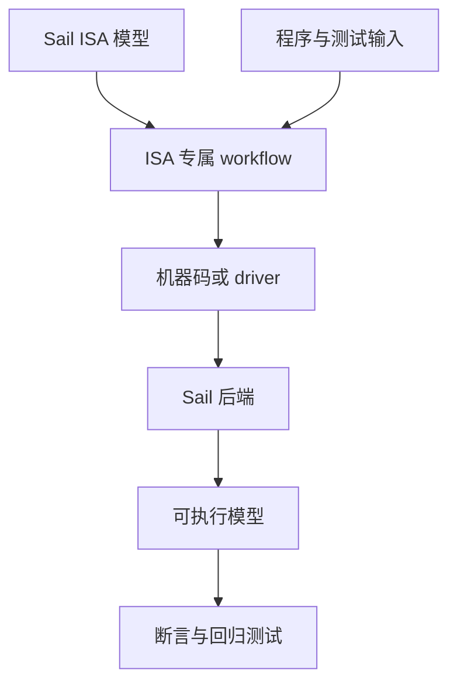

# verylogic Sail ISA Workspace

[English](README.md) · [文档](https://vidlg.github.io/verylogic-workspace-sail/zh/) · [MDX 源码](site/docs/zh/index.mdx)

这是一个使用 [Sail](https://github.com/rems-project/sail) 描述、运行和测试指令集架构（ISA）的教学工作区。每个 ISA 都是独立模块，拥有自己的模型、程序、工具和测试；配套教程与实现原理通过 Rspress 发布为中英文 MDX 站点。

## 从这里开始

| 目标 | 入口 |
| --- | --- |
| 运行 Hack 模型 | [快速开始](#快速开始) |
| 学习 Hack 与 Sail | [Hack 入门教程](https://vidlg.github.io/verylogic-workspace-sail/zh/hack/tutorial) |
| 学习指令语义 | [Hack ISA](https://vidlg.github.io/verylogic-workspace-sail/zh/hack/isa) |
| 理解汇编器和执行器 | [Hack 文档](https://vidlg.github.io/verylogic-workspace-sail/zh/hack/) |
| 直接维护 Hack 包 | [`isa/hack/README.zh-CN.md`](isa/hack/README.zh-CN.md) |
| 增加另一个 ISA | [增加 ISA](#增加-isa) |

## 为什么使用 Sail

ISA 是处理器对软件公开的契约，包括指令编码、架构状态，以及每条指令产生的状态转换。Sail 可以让同一份模型同时作为可读规范、可执行实现，以及代码生成和形式化工具的输入。

本工作区在 Sail 模型之外补齐教学和测试一条 ISA 所需的模块化工具：



## 快速开始

安装 [Pixi](https://pixi.sh/latest/installation/)，然后在仓库根目录执行：

```sh
pixi run just install
pixi run sail --version
pixi run just hack list
pixi run just hack run multiply
```

Hack 程序成功时会输出 `ASSERT PASS` 和最终架构状态。接着阅读 [Hack 入门教程](https://vidlg.github.io/verylogic-workspace-sail/zh/hack/tutorial)，查看源码、机器码、生成的 Sail driver 和断言怎样串起来。

运行全仓库测试：

```sh
pixi run just test
```

## ISA 模块

| ISA | 模型 | 文档 | 包参考 |
| --- | --- | --- | --- |
| Hack | nand2tetris 的 16 位教学 ISA | [教程与内部原理](https://vidlg.github.io/verylogic-workspace-sail/zh/hack/) | [`isa/hack`](isa/hack/README.zh-CN.md) |

模块命令使用统一的外层形式：

```text
pixi run just <isa> <action> [program]
```

每个模块按自身工具链提供适用的 action：

| action | 用途 |
| --- | --- |
| `list` | 列出可运行示例 |
| `check` | 类型检查 Sail 模型 |
| `assemble` | 生成机器码或 ISA 专属中间产物 |
| `run` | 执行一个示例 |
| `test` | 运行模块回归测试 |
| `clean` | 删除生成产物 |

统一的是动作名称；assembler、loader、driver、metadata 和执行策略仍由各 ISA 模块决定。

## 平台与依赖

Pixi 提供 Python、Pytest、Just、GMP、Node.js 22 和宿主机 C 编译器。项目把 Sail `0.20.2` 安装到 Git 忽略的 `.pixi/sail/`，不依赖系统 `PATH` 中的任意 Sail 版本。

支持平台：

- Windows AMD64；
- Linux x86_64；
- Linux aarch64。

Sail `0.20.2` 没有官方 macOS 二进制资产，因此安装器只支持上面列出的宿主平台。它会选择对应平台的官方资产、校验 SHA-256，并拒绝不安全的归档路径和链接。

## 文档站

中英文 MDX 站点位于 `site/`，使用 [Rspress](https://rspress.dev/) 构建：

```sh
pixi install
pixi run just site install  # 安装锁定的站点依赖
pixi run just site dev      # 启动开发服务器
pixi run just site build    # 静态产物输出到 site/dist/
pixi run just site preview  # 预览构建结果
```

文档源码使用稳定的语言和 ISA 路径：

```text
site/docs/<locale>/<isa>/<article>.mdx
```

例如，`site/docs/zh/hack/assembler.mdx` 对应 `/zh/hack/assembler`。

## 增加 ISA

1. 新建 `isa/<name>/`，从最小可用 Sail 模型开始。
2. 把程序、工具、测试、Hook 和构建产物保留在该模块内。
3. 添加模块 `justfile`，定义它支持的 action。
4. 在根 `justfile` 注册模块，并加入聚合测试和清理命令。
5. 添加结构对应的 `site/docs/en/<name>/` 与 `site/docs/zh/<name>/`。
6. 把新模块加入 Rspress sidebar 和上面的 ISA 表格。

典型模块结构：

```text
isa/<name>/
├── README.md / README.zh-CN.md
├── <model>.sail
├── justfile
├── programs/
├── tools/
├── tests/
└── .build/
```

## `.sail` 编辑器高亮

Sail 的部分语法与 OCaml 相似，但 Sail 不是 OCaml。[`.zed/settings.json`](.zed/settings.json) 把 `*.sail` 映射为 OCaml 语法高亮，同时关闭 OCaml LSP 与 formatter，避免错误诊断或改写。

其他编辑器没有 Sail 支持时，也可以把 OCaml 模式作为近似高亮。源码正确性应由模块的 `check` 命令验证，而不是依赖备用高亮。

## 仓库布局

```text
isa/                  自包含 ISA 模块
site/                 Rspress 配置与中英文 MDX 文档
support/              Sail C 后端共享兼容代码
tests/                根级工具测试
tools/install_sail.py 固定版本 Sail 安装器
justfile              工作区与站点命令
pixi.toml / pixi.lock 跨平台环境
```
