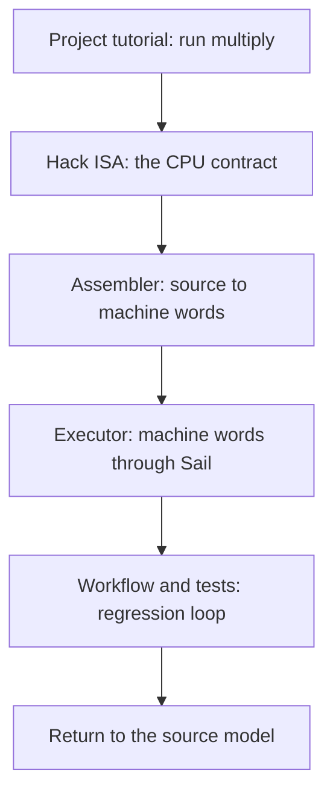

# verylogic Sail Documentation

[中文](README.zh-CN.md) · [Project tutorial](../README.md) · [Hack package reference](../isa/hack/README.md)

This directory contains the long-form design and implementation guides. The root README is a getting-started tutorial, while `isa/hack/README*` is a command and syntax reference. The documents here explain why the system is designed this way and how the code works internally.

## Recommended learning path



### Stage 1: understand the machine

Read [The Hack ISA](hack/ISA.md):

- ISA versus microarchitecture;
- responsibilities of `A`, `D`, `PC`, RAM, and ROM;
- A/C encodings and the `comp`, `dest`, and `jump` fields;
- precise `old_A`, simultaneous write-back, and jump semantics;
- why Hack+ is not part of the ISA.

### Stage 2: understand translation

Read [Hack assembler internals](hack/ASSEMBLER.md):

- how a hand-written line parser builds a typed intermediate representation;
- why pseudoinstructions lower before assembly pass one;
- two-pass resolution of labels, predefined symbols, and variables;
- encoding A/C instructions as 16-bit words;
- preserving `.assert`, `.hook`, and `.max_steps` as side metadata;
- why the annotated `.hack` artifact is written and strictly reloaded.

### Stage 3: understand execution and testing

Read [Hack execution and test workflow](hack/EXECUTION.md):

- why `hack.sail` has no program-specific `main()`;
- how the executor generates ROM as a Sail `match`;
- exact ordering of hooks, execution, stopping rules, and assertions;
- how the Sail C backend, GCC/MinGW, GMP, and runtime are linked;
- how `workflow.py`, `programs.toml`, and Just organize commands;
- what Pytest, Sail conformance, and assembly integration tests each verify.

## Documentation map

| Document | Main question | Primary source |
| --- | --- | --- |
| [Project tutorial](../README.md) | How do I install, run, and start reading? | Whole repository |
| [Hack ISA](hack/ISA.md) | What does the Hack CPU promise software? | `isa/hack/hack.sail` |
| [Assembler internals](hack/ASSEMBLER.md) | How does `.asm` become a trustworthy `.hack` artifact? | `isa/hack/tools/assembler.py` |
| [Execution and tests](hack/EXECUTION.md) | How does `.hack` become an executable and get verified? | `executor.py`, `workflow.py`, tests |
| [Hack package reference](../isa/hack/README.md) | What exact commands, directives, and hook APIs exist? | Public Hack package interface |

## Documentation principles

- **README is the entrance**: get a new Sail/Hack reader to a successful run quickly.
- **docs is the textbook**: follow concepts and call paths, with room for design rationale.
- **package README is the reference**: optimize for readers who already know what they need to look up.
- **source is authoritative**: every documented behavior should map to concrete functions and tests.
- **English and Chinese stay aligned**: long-form guides have both versions, distinguished by `.zh-CN`.

## Where to start

Run these commands on a first pass:

```sh
pixi run just hack run multiply
pixi run just hack asm multiply
pixi run just hack check
pixi run just hack test
```

Then inspect:

```text
isa/hack/.build/multiply.hack
isa/hack/.build/multiply.driver.sail
isa/hack/.build/multiply.c
```

Use the three guides to trace one `multiply.asm` program all the way to its final executable.
