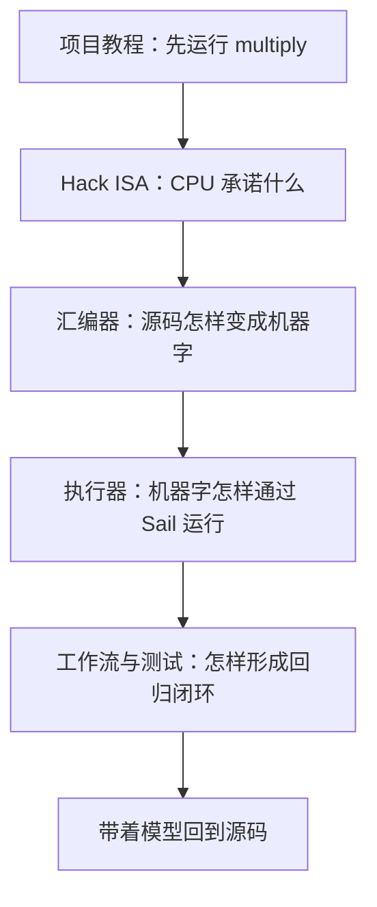

# verylogic Sail 文档中心

[English](README.md) · [项目教程](../README.zh-CN.md) · [Hack 包参考手册](../isa/hack/README.zh-CN.md)

这里收集需要连续阅读的原理性文档。根目录 README 是上手教程，`isa/hack/README*` 是命令与扩展语法参考；`docs/` 则回答“为什么这样设计”和“代码内部怎样工作”。

## 推荐学习路线



### 第一阶段：理解机器

阅读 [Hack 指令集架构](hack/ISA.zh-CN.md)：

- ISA 与微架构有什么区别；
- `A`、`D`、`PC`、RAM 和 ROM 的职责；
- A/C 指令、`comp`、`dest`、`jump` 的编码；
- `old_A`、同时写回和跳转的精确语义；
- Hack+ 为什么不属于 ISA。

### 第二阶段：理解翻译

阅读 [Hack 汇编器内部原理](hack/ASSEMBLER.zh-CN.md)：

- 手写行解析器怎样产生类型化中间表示；
- 伪指令为何必须在第一遍汇编之前展开；
- 标签、预定义符号和变量怎样通过两遍汇编解析；
- A/C 指令如何编码为 16 位机器字；
- `.assert`、`.hook`、`.max_steps` 怎样作为旁路元数据保存；
- 为什么 `.hack` 写出后还要严格重新加载。

### 第三阶段：理解执行与测试

阅读 [Hack 执行器与测试工作流](hack/EXECUTION.zh-CN.md)：

- 为什么 `hack.sail` 不包含特定程序的 `main()`；
- executor 怎样把 ROM 生成为 Sail `match`；
- Hook、执行循环、停止条件与断言的准确顺序；
- Sail C 后端、GCC/MinGW、GMP 和运行时怎样连接；
- `workflow.py`、`programs.toml` 与 Just 怎样组织命令；
- Pytest、Sail conformance 和程序集成测试分别验证什么。

## 文档地图

| 文档 | 主要问题 | 对应源码 |
| --- | --- | --- |
| [项目教程](../README.zh-CN.md) | 怎样安装、运行并开始阅读？ | 整个仓库 |
| [Hack ISA](hack/ISA.zh-CN.md) | Hack CPU 对软件承诺什么？ | `isa/hack/hack.sail` |
| [汇编器原理](hack/ASSEMBLER.zh-CN.md) | `.asm` 怎样变成可信的 `.hack`？ | `isa/hack/tools/assembler.py` |
| [执行与测试](hack/EXECUTION.zh-CN.md) | `.hack` 怎样变成可执行程序并被验证？ | `executor.py`、`workflow.py`、测试 |
| [Hack 包参考手册](../isa/hack/README.zh-CN.md) | 具体命令、指令和 Hook 语法是什么？ | Hack 包公开接口 |

## 文档组织原则

- **README 是入口**：先让第一次接触 Sail/Hack 的读者跑起来。
- **docs 是教材**：围绕概念和调用链展开，可以较长，并解释设计取舍。
- **包 README 是参考**：面向已经知道要查什么的读者，快速定位语法和命令。
- **源码是最终依据**：文档中的行为必须能映射到具体函数和测试。
- **中英文结构对齐**：原理文档提供英文与中文版本，文件名通过 `.zh-CN` 区分。

## 从哪里开始

第一次阅读建议依次执行：

```sh
pixi run just hack run multiply
pixi run just hack asm multiply
pixi run just hack check
pixi run just hack test
```

然后打开生成的：

```text
isa/hack/.build/multiply.hack
isa/hack/.build/multiply.driver.sail
isa/hack/.build/multiply.c
```

配合三份原理文档，从同一个 `multiply.asm` 一直追踪到最终可执行程序。
