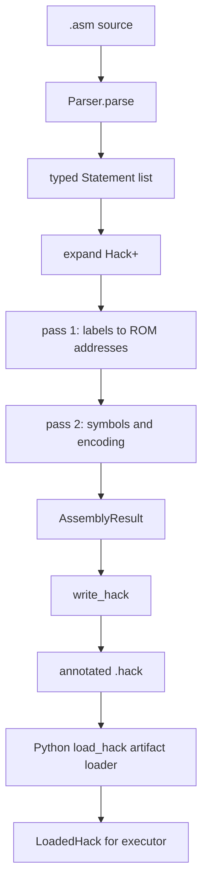

# Hack Assembler Internals

[← Hack ISA](/hack/isa) · [Common teaching contract](/reference/teaching-contract) · [中文](/zh/hack/assembler) · [Execution and tests →](/hack/execution)

This guide follows [`isa/hack/tools/assembler.py`](https://github.com/VIDLG/verylogic-workspace-sail/blob/main/isa/hack/tools/assembler.py) and [`artifact.py`](https://github.com/VIDLG/verylogic-workspace-sail/blob/main/isa/hack/tools/artifact.py). It explains how source becomes profile-specific Hack machine code, then crosses a strict persisted-artifact boundary. Commands default to 16-bit `hack16`; `--profile hack32` selects 32-bit words. Shared directive and manifest rules are defined by the [common teaching contract](/reference/teaching-contract). `assembler.py` remains a pure library; `assembler_cli.py` is the thin CLI boundary that handles arguments and publication.

## The assembler's responsibility

Input can contain three kinds of information:

```asm
.description Example program
SET R0, 6             // Hack+ pseudoinstruction
(LOOP)                // assembly symbol
@R0                   // standard A instruction
D=M                   // standard C instruction
.assert R0 == 6       // execution metadata
.max_steps 1000
```

Parsed source has two destinations:

1. `records`: real `MachineWord` values that enter ROM;
2. `AssemblyMetadata`: HALT addresses, assertions, effective runtime settings with origins, source identity, and `.description`.

Workflow reads the description through the same parser for program discovery. `artifact.py` serializes it into the `.hack` manifest, while directives still emit no ROM word. This keeps teaching metadata observable without pretending that it is Hack code.



## Why a hand-written parser is enough

Hack assembly is a line-oriented language with no nested expressions, precedence, or multiline syntax. A parser generator would add little value here. Regular expressions recognize each line shape, while Python dataclasses form a typed intermediate representation.

Simple does not mean permissive. The parser rejects:

- malformed labels and symbols;
- unknown `comp`, `dest`, and `jump` forms;
- duplicate `.description` or `.max_steps` directives;
- unknown dot directives;
- out-of-range A operands, RAM targets, and assertion values;

For an educational assembler, explicit rejection is better than guessing the author's intent.

## Phase 1: preserve source identity

Every meaningful line first gets a `SourceLine`:

```python
@dataclass(frozen=True)
class SourceLine:
    line: int
    text: str
```

It retains both the line number and original text. If one pseudoinstruction later expands into four machine instructions, all four still point to the same `SourceLine`. The writer can therefore emit:

```text
ROM[0000] L1 [1/4] SET R0, 6 => @6
ROM[0001] L1 [2/4] SET R0, 6 => D=A
```

This is a useful compiler principle: **source locations belong in the IR; do not try to reconstruct them only when reporting an error**.

## Phase 2: typed statements

`Parser.parse()` produces a `Statement` union instead of integers:

| IR node | Meaning | Enters ROM? |
| --- | --- | --- |
| `AInstruction` | `@value` or `@symbol` | Yes |
| `CInstruction` | `dest=comp;jump` | Yes |
| `Label` | `(NAME)` | No |
| `PseudoInstruction` | Hack+ form | After lowering |
| `AssertionDirective` | `.assert` | No; metadata |
| `MaxStepsDirective` | `.max_steps` | No; metadata |
| `DescriptionDirective` | `.description` | No; discovery and manifest metadata |

The parser dispatch order is deliberate:

1. remove text after `//` and trim whitespace;
2. recognize `.description`, `.assert`, and `.max_steps`;
3. recognize labels;
4. recognize A instructions beginning with `@`;
5. use the first word to recognize Hack+;
6. parse everything else as a C instruction.

Dot directives come first so an invalid `.assert` or `.description` gets a directive-specific error rather than an ambiguous “bad C instruction.” Handling `@` separately similarly distinguishes an invalid operand from a non-A instruction.

`source_description(text)` scans the same typed statements for workflow discovery. `expand()` omits `DescriptionDirective` from code lowering, and `assemble_text()` copies its text into `AssemblyMetadata.description`. `artifact.py` then serializes that value as manifest `description`; it never enters ROM.

### A-instruction validation

An A operand is either:

- a decimal value in the selected A-immediate range: `0..32767` for `hack16`, `0..2147483647` for `hack32`;
- a Hack symbol matching `[A-Za-z_.$:][A-Za-z0-9_.$:]*`.

The parser retains symbolic operands as strings because label addresses are not known yet and variable allocation must not happen early.

### C-instruction normalization

Whitespace is allowed around fields and then removed. This source:

```asm
AD = D + 1 ; JGT
```

becomes:

```python
CInstruction(dest="AD", comp="D+1", jump="JGT")
```

The `COMP`, `DEST`, and `JUMP` tables validate each field. They are both encoding tables and the accepted language definition; unknown combinations never reach assembly passes.

## Phase 3: lower Hack+

`expand()` walks the typed statements:

- standard instructions and labels enter the code stream;
- directives are collected as side metadata;
- each `PseudoInstruction` becomes standard A/C instructions.

For example:

```asm
JEQ R1, DONE
```

lowers to:

```asm
@R1
D=M
@DONE
D;JEQ
```

Each lowered instruction carries `PseudoExpansion(instruction, index, count)`, while `source` still points at the original `JEQ` line. The four results therefore retain both their canonical spelling and positions `[1/4]` through `[4/4]`.

### Why lowering must precede label collection

Consider:

```asm
SET R0, 6
(AFTER)
@AFTER
0;JMP
```

`SET` occupies four ROM words, so `AFTER=4`. If pass one counted source lines before expanding `SET`, it would incorrectly assign `AFTER=1`.

The valid order is therefore:

```text
parse → lower → collect labels → final encoding
```

`HALT` is also lowered here into a unique private label:

```asm
(__HACKPLUS_HALT_0)
@__HACKPLUS_HALT_0
0;JMP
```

Its private-label address is additionally collected in `halt_addresses` for the executor.

See the [ISA guide](/hack/isa#how-hack-lowers-to-real-instructions) for the complete Hack+ lowering table.

## Phase 4: two-pass assembly

### Pass one: build the ROM symbol table

`assemble_text()` starts with predefined symbols:

```text
R0..R15
SP LCL ARG THIS THAT
SCREEN KBD
```

`R0..R15` map directly to RAM addresses `0..15`; they are predefined assembler symbols, not architectural registers. `SP/LCL/ARG/THIS/THAT` are aliases for the first five of those same addresses.

It then walks the lowered code:

- a `Label` records the current ROM address;
- each A/C instruction enters the instruction list and increments that address;
- labels occupy no machine word;
- duplicate labels and programs beyond 32768 words fail immediately.

Every branch label has a stable address when pass one finishes.

### Pass two: resolve A symbols and encode

Pass two visits only real A/C instructions.

For an A instruction:

1. use a decimal operand directly;
2. look up a known symbol;
3. allocate an unknown variable consecutively from RAM address `16`;
4. place the value after a leading zero in the selected profile: 15 immediate bits for `hack16`, 31 for `hack32`.

Later uses of the same variable reuse its first allocation.

A C instruction uses the same canonical fields in both profiles:

```text
hack16: 111 + COMP[comp] + DEST[dest] + JUMP[jump]
hack32: 0xFFFF + 111 + COMP[comp] + DEST[dest] + JUMP[jump]
```

For example, `D=M+1;JGT` gives:

```text
comp=M+1  -> 1110111
dest=D    -> 010
jump=JGT  -> 001
word       = 1111110111010001
```

Each result is wrapped as:

```python
MachineWord(value, source, expansion)
```

For ordinary A/C instructions, `expansion` is `None`. For Hack+ output, it is a `PseudoExpansion` containing the canonical instruction and its `[i/n]` position, so machine code, original source, and lowering provenance remain connected.

## Metadata is a side channel, not code

`AssemblyMetadata` contains:

```python
halt_addresses: tuple[int, ...]
assertions: tuple[Assertion, ...]
max_steps: int
max_steps_origin: Literal["default", "source", "cli"]
```

Directives do not advance ROM. Removing all `.assert` lines must leave every standard machine word unchanged; the test suite explicitly fixes this property.

### What assertion assembly does

The assembler only:

- uses the public parser to enforce bit-exact equality and explicit `signed(...)`/`unsigned(...)` ordered comparisons;
- validates Hack targets and widths, then canonicalizes representation;
- retains the source line.

It never reads final registers or evaluates assertions in Python. The executor turns metadata into Sail assertions inside the generated driver.

That separation is intentional: Python translates; Sail executes and judges architectural state.

## `write_hack()`: an auditable artifact

`artifact.py` writes two record classes.

### Opening structured manifest block

`write_hack()` delegates to the shared renderer. At `summary` and `full`, it writes one indented canonical S-expression as a contiguous block at the start of the file, with every line prefixed by `//% `. At `none`, it writes the same form as one compact prefixed line. The schema is `verylogic.annotated-image`; the public envelope contains runtime `max_steps`, assertions, completion, and ISA metadata. Hack direct assembly omits empty frontend `provenance`. Hack-specific validation fixes `isa=hack`, `profile=hack16|hack32`, source kind `asm`, profile word width, memory dimensions, and lowered-self-loop completion; `standard` is never a valid profile. Runtime values carry `cli`, `source`, or `default` origins.

### Source-mapped machine words

```text
0000000000000110 // ROM[0000] L1 [1/4] SET R0, 6 => @6
1110110000010000 // ROM[0001] L1 [2/4] SET R0, 6 => D=A
```

This default example begins with a normal 16-bit `hack16` word. A `hack32` line begins with 32 binary digits and is not an ordinary nand2tetris `.hack` word. This project's profile-aware executor reconstructs the complete contract from the manifest and annotations.

### Teaching detail levels

The optional `comments` argument controls explanatory content without changing machine words or semantic metadata. The manifest is always present and records the selected comment level:

| Level | Word annotation |
| --- | --- |
| `none` | One compact opening manifest line followed by words; no human preamble or trailing explanation |
| `summary` | ROM/source location and normalized assembly for every word; Hack+ adds `[i/n] source => canonical`; inline comments stay at the far right |
| `full` | Summary information plus the exact complete original source text |

`summary` is the default. It shows ordinary A/C source as well as pseudoinstruction lowering, with inline assembly comments at the far right. The opening `//%` manifest block is written at every level. Run `pixi run just hack assemble multiply`, or override `max_steps` with `pixi run just hack assemble multiply summary --max-steps 10000`. `apply_runtime_overrides()` resolves CLI over source/default before `write_hack()`, so both each effective value and its origin cross the artifact boundary.

## Why `load_hack()` exists

The executor does not retain the in-memory `AssemblyResult`. It calls `write_hack()` and then reloads the file through `load_hack()`.

This creates an explicit boundary:

```text
assembler internals --write--> .hack artifact --strict load--> executor input
```

Without reload, a writer bug could omit metadata while execution still “worked” from the old in-memory object. Reload ensures execution depends only on the artifact actually delivered to disk.

### Strict Python artifact-loader rules

The loader here is `isa/hack/tools/artifact.py::load_hack()`. It verifies:

- exactly one contiguous manifest block appears at the start of the file, uses the comment-level-specific formatting, and has the exact common version-1 key set;
- ISA/profile, source identity, description, comment level, runtime value/origin, assertions, completion, and `isa_metadata` have exact types and legal values;
- equality assertions use `bits` mode with no wrapper, while ordered assertions use explicit `signed` or `unsigned` mode;
- each machine word has exactly the selected profile width (16 or 32 binary digits), and comment presence matches the manifest level;
- each completion address points at an `@address; 0;JMP` self-loop;
- ROM has at most 32768 words.

`load_hack()` accepts only the strict annotated format and rejects a file without an opening manifest block or with a profile mismatch. Raw nand2tetris interoperability requires a separate explicit frontend because a raw image cannot truthfully supply descriptions, assertions, watchdog origin, or completion metadata. `hack32` additionally has 32-bit words and is not ordinary nand2tetris `.hack` compatibility.

## Error design

Source problems use `AssemblyError(line, message)`, which the CLI reports through `argparse`. Because locations entered the IR at parse time, errors involving lowered instructions still identify the user's original line.

Artifact problems use `ValueError` messages containing file path and artifact line number. These are different error domains:

- `AssemblyError`: invalid source program;
- `ValueError` from `load_hack`: damaged or untrusted intermediate artifact.

Collapsing both into “assembly failed” would hide which boundary broke.

## Call map

```text
assembler_cli.py
├── assembler.assemble(source)
├── artifact.apply_runtime_overrides(result)
└── artifact.write_hack(result, output)

assembler.py
└── assemble(source)
    └── assemble_text(text)
        ├── parse(text)
        │   └── Parser.parse
        ├── expand(statements)
        ├── pass 1: labels
        └── pass 2: symbols + encode

artifact.py
├── apply_runtime_overrides(result)
├── write_hack(result, output)
└── load_hack(output)
    └── LoadedHack(words, metadata, word_comments, manifest)

executor.py
└── strict reload → driver generation
```

Recommended function reading order:

1. `Parser.parse`
2. `Parser._parse_instruction`
3. `expand`
4. `assemble_text`
5. `write_hack`
6. `load_hack`

## How tests cover the assembler

[`test_assembler.py`](https://github.com/VIDLG/verylogic-workspace-sail/blob/main/isa/hack/tests/test_assembler.py) fixes contracts at every phase rather than checking only a few example programs:

| Test direction | Regression prevented |
| --- | --- |
| valid/invalid symbols | silently treating malformed labels as variables |
| pseudoinstruction source mapping | losing original line and text during lowering |
| annotated `.hack` round trip | writer and loader semantic drift |
| directives emit no words | test facilities changing the real program |
| assertion modes and ranges | signed/unsigned interpretation errors |
| strict metadata rejection | accepting damaged artifacts permissively |
| parameterized official encoding tables | drifting from nand2tetris `comp/dest/jump` encodings |

Integration runs of `programs/*.asm` then verify that parsed and encoded programs produce the expected architectural state on the Sail ISA.

## Suggested exercises

### Exercise 1: perform two passes by hand

For this source, list lowered ROM addresses, the symbol table, and machine words:

```asm
SET sum, 1
(LOOP)
INC sum
GOTO LOOP
```

Notice that variable `sum` is allocated at `16`, while `LOOP` uses a ROM address from the expanded program.

### Exercise 2: design a pseudoinstruction

Write its standard Hack expansion first, then answer:

- which registers does it clobber?
- in which phase must it lower?
- does it need a private label?
- how will it preserve `SourceLine`?
- should tests fix words, source mappings, or metadata?

Only then modify `PSEUDO_NAMES`, parsing patterns, and `expand()`.

### Exercise 3: inspect a round trip

```sh
pixi run just hack assemble multiply
```

Open `isa/hack/.build/hack16/asm/multiply/multiply.hack` (or `.build/hack32/asm/multiply/multiply.hack` after assembling with `--profile hack32`)

- each source pseudoinstruction;
- its standard expansion;
- ROM address;
- profile-width machine word;
- file-level metadata.

Continue with [Execution and test workflow](/hack/execution) to follow this `.hack` artifact into a running program.
