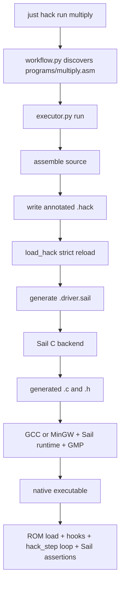
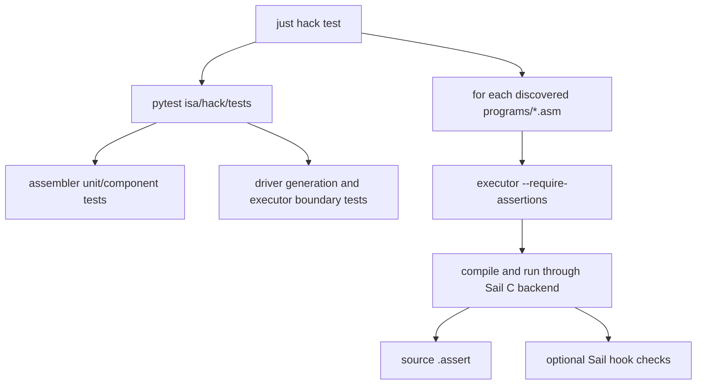

# Hack Execution and Test Workflow

[← Assembler internals](/hack/assembler) · [Hack overview](/hack/) · [中文](/zh/hack/execution)

This guide follows [`executor.py`](https://github.com/VIDLG/verylogic-workspace-sail/blob/main/isa/hack/tools/executor.py) and [`workflow.py`](https://github.com/VIDLG/verylogic-workspace-sail/blob/main/isa/hack/tools/workflow.py) to explain how Hack machine code becomes a native executable through Sail's C backend, and how unit, ISA conformance, and assembly integration tests form one regression loop.

## Responsibility boundaries

| File | Responsible for | Not responsible for |
| --- | --- | --- |
| `hack.sail` | ROM storage, raw-word fetch, A/C decode, typed `hack_step()`, ALU, registers, RAM, and PC transitions | Loading a particular program image, a program-specific `main()`, test program discovery |
| `executor.py` | Program driver generation, raw ROM loading, run control, Sail/C compilation, assertions, and output | A/C decoding, program discovery, and batch-test policy |
| `workflow.py` | Source discovery and `check/assemble/run/test/clean` orchestration | ISA semantics and judging machine state itself |

This split keeps `hack.sail` reusable as an ISA model. Running another Hack program requires another generated ROM loader and driver, not a change to fetch, decode, or CPU semantics.



## Why `hack.sail` has no `main()`

The ISA owns the architectural ROM and answers how one step fetches a raw word, decodes it, and changes architectural state. A runnable program must additionally define:

- which raw machine words to load into ROM;
- when execution is complete;
- which hooks run around each step;
- which final assertions to check;
- which state to print.

Those program-specific answers do not belong in the ISA. `executor.write_driver()` generates a small Sail `main()` for each `.hack` artifact; it loads the image into model-owned `ROM`, then supplies run control around `hack_step()`.

This resembles a real system boundary: a CPU model defines storage, fetch, decode, and instruction behavior, while a loader or simulator supplies the program image and run-control policy.

## Full `executor.run()` sequence

```text
1. Validate CLI arguments
2. assemble(program) into AssemblyResult
3. Resolve effective CLI/source `max_steps` and Hook settings
4. Apply CLI overrides to assembly metadata
5. Enforce assertion and ROM-size preconditions
6. Remove stale artifacts with the same prefix
7. write_hack() to <output>.hack
8. Strictly reload it with load_hack()
9. write_driver() to <output>.driver.sail
10. Resolve the package-local hook from reloaded metadata
11. Generate C with Sail
12. Link with a C compiler, Sail runtime, and GMP
13. Run the native executable
```

Steps 7 and 8 are the important design boundary. Effective CLI overrides are first serialized into `.hack`; the executor does not pass an in-memory assembly object straight to driver generation. See [Why `load_hack()` exists](/hack/assembler#why-load_hack-exists).

### Which settings belong on which surface

| Concern | Source | CLI | Reason |
| --- | --- | --- | --- |
| Hook | `.hook` | `--hook` | Per-run runtime strategy |
| Step budget | `.max_steps` | `--max-steps` | Per-run runtime strategy |
| Description | `.description` | None | Source identity for discovery |
| Checks | `.assert` | None | Source-owned regression contract |
| Artifact comments | None | `--comments` | Host presentation only |
| Output prefix | None | `--output` | Host filesystem policy |
| Assertion requirement | None | `--require-assertions` | Workflow/test gate |

Thus CLI coverage is intentional rather than mechanical: only runtime settings use `CLI > source > default`. CLI cannot silently replace source assertions or descriptions.

## Build artifacts

For `multiply`, the output prefix is:

```text
isa/hack/.build/multiply
```

The executor can generate:

| Artifact | Producer | Purpose |
| --- | --- | --- |
| `multiply.hack` | `write_hack()` | Stable machine-word and metadata boundary |
| `multiply.driver.sail` | `write_driver()` | Program-specific ROM load lines, run control, assertions, and output |
| `multiply.c` | Sail C backend | C implementation of ISA + hook + driver |
| `multiply.h` | Sail C backend | Declarations for generated C |
| `multiply.exe` on Windows or `multiply` on Linux | C compiler | Final native program |

Stale artifacts are removed before each run so a failed compilation cannot accidentally leave an old executable that appears current. On Windows, the code can use `icacls` to recover current-user permission when deletion is denied.

## `LoadedHack` is the real executor input

After reload, the object contains only:

```python
@dataclass(frozen=True)
class LoadedHack:
    words: list[int]
    metadata: AssemblyMetadata
    word_comments: tuple[str | None, ...] = ()
```

There is no parser AST, symbol table, or hidden Python assembly state. Driver behavior can come only from:

- machine words in `.hack`;
- structured metadata at the top of `.hack`;
- optional per-word teaching comments reloaded from `.hack`;
- fixed `hack.sail` semantics;
- the package-local hook selected by metadata.

`test_run_uses_hook_path_from_reloaded_metadata` specifically proves that hook selection comes from the **reloaded artifact**, not the earlier `AssemblyResult`.

## How the driver loads model-owned ROM

`hack.sail` owns the complete architectural instruction memory and raw fetch operation:

```ocaml
register ROM : vector(32768, word)

function fetch_hack(pc : program_counter) -> word =
  ROM[unsigned(pc)]
```

`fetch_hack(pc)` returns the raw 16-bit `word`; it does not decode it. The model's `hack_step()` composes the architectural path:

```text
fetch_hack(PC) -> decode_hack(word) -> execute(decoded instruction) -> typed step result
```

`write_driver()` no longer emits `instruction_at`, `execute_at`, or an address-to-decode `match`. It emits a `load_program()` function containing raw assignments instead:

```ocaml
function load_program() -> unit = {
  ROM[0] = 0b0000000000000110; // ROM[0000] L4 [1/4] SET R0, 6 => @6
  ROM[1] = 0b1110110000010000; // ROM[0001] L4 [2/4] SET R0, 6 => D=A
  // ...
}
```

Python only reloads words and writes these ROM load lines. It never decodes A- or C-instructions; legality, decode, and execution remain in Sail. `hack_step()` returns a typed result, and generated `main()` matches that result directly: a retired step continues, while an illegal encoding becomes an explicit driver assertion failure.

The same `none / summary / full` level used for `.hack` controls driver comments. At the default `summary`, each `ROM[index] = word` line carries normalized assembly source, Hack+ words also carry `[i/n] source => canonical`, and inline assembly comments stay at the far right. `full` adds exact original source text and expands the explanations for assertion sources, hooks, and final output. These comments come from `LoadedHack.word_comments`, proving they survived the file boundary.

`load_program()` writes only the loaded image. Generated `main()` calls `execution_should_continue(PC, steps)` before each attempt, so it never calls `hack_step()` beyond the program's loaded ROM extent.

## How the driver stops and validates completion

The generated driver centralizes the subtle run condition in one small function:

```ocaml
let lowered_halt_0 : program_counter = 0b000000000110011
let driver_max_steps : int = 100000

function execution_should_continue(pc : program_counter, steps : int) -> bool = {
  (pc != lowered_halt_0)
  & unsigned(pc) < loaded_rom_words
  & steps < driver_max_steps
}
```

The loop itself stays direct:

```ocaml
while execution_should_continue(PC, steps) {
  // one checked hack_step
}
```

`loaded_rom_words` is generated from the reloaded artifact's word count—for `basic_alu` it is `53`, covering ROM addresses `0..52`. It is not `max_steps` and does not limit how many times a loop may revisit those addresses. Each `lowered_halt_n` value is generated from a reloaded `//%hack halt {"address": ...}` metadata record; the bit pattern has no special meaning in the Hack ISA.

The condition becomes false in three cases, which the driver distinguishes after the loop:

1. `PC` reaches a HALT address recorded in `.hack` metadata: valid completion;
2. `PC` leaves the loaded ROM image: explicit execution error;
3. `steps` reaches `driver_max_steps`: valid only for an explicitly requested bounded snapshot, otherwise watchdog failure.

### Why the HALT loop does not execute here

Hack+ `HALT` lowers to:

```asm
(HALT_PRIVATE)
@HALT_PRIVATE
0;JMP
```

Metadata records the private-label address. The driver sees completion when `PC` reaches that address and exits before executing the loop. The two loop words remain in `.hack`, so the artifact is still a legal native Hack program that would stay in its self-loop.

This is deliberately driver policy. Standard Hack has no encoded HALT instruction: Hack+ `HALT` is an assembler convenience, ROM end comes from the loaded artifact, and neither is an architectural outcome from `hack.sail`. If the ISA later gains a real HALT opcode, decoding and returning that outcome would belong in the model.

### The 32768-word ROM edge case

`PC` is 15 bits and cannot exceed `32767`. For a completely full 32768-word image, `PC >= loaded_rom_words` can never become true: there is no representable “one past the ROM” address. A recorded `HALT` can complete such a program normally; otherwise the explicit or default step budget still bounds the host run and fails as a watchdog unless the source explicitly requests a bounded snapshot.

## Generated run loop

The generated `main()` first calls `load_program()`. Its run-control sequence is conceptually:

```ocaml
load_program();
var steps : int = 0;
hack_hook_before_run();
while execution_should_continue(PC, steps) {
  hack_hook_before_step(steps);
  match hack_step() {
    HackRetired(()) => (),
    HackIllegalInstruction(_) => assert(false, "illegal Hack instruction encoding")
  };
  steps = steps + 1;
  hack_hook_after_step(steps)
};
assert (unsigned(PC) < loaded_rom_words,
        "program counter left the loaded ROM image");
// assertions
hack_hook_after_run(steps);
```

The inline `match` returns on `HackRetired(())` and asserts on `HackIllegalInstruction(_)`. Fetch, decode, and execute remain one model-owned `hack_step()`; generated `main()` only turns its typed result into driver policy.

The ordering contract is:

| Point | Meaning of `step` |
| --- | --- |
| `load_program()` | Populate model-owned `ROM` before execution |
| `before_run()` | Before entering the run loop |
| `before_step(steps)` | Next instruction index, zero-based |
| inline `match hack_step()` | Check the result of the model-owned fetch → decode → execute transition |
| `steps = steps + 1` | Increment completed instruction count |
| `after_step(steps)` | One-based completed count |
| source assertions | Core regression contract after the loop |
| `after_run(steps)` | Called only after source assertions pass |

The executor component tests fix this contract by checking source order in the generated driver.

## Two meanings of `max_steps`

The effective limit has this precedence:

```text
CLI --max-steps > source .max_steps > default watchdog (100000)
```

A CLI value replaces source `.max_steps` in the generated `.hack` metadata before strict reload. The generator then emits `driver_max_steps` from reloaded metadata, or uses the default for normal executor runs; `execution_should_continue` requires `steps < driver_max_steps`. This guarantees a finite host run even when a program loops forever without reaching lowered HALT metadata.

### Watchdog mode

If a program has HALT, reaching the limit requires that `PC` has already reached one of its generated `lowered_halt_n` values:

```ocaml
assert ((PC == lowered_halt_0),
        "maximum step limit reached before lowered HALT")
```

For a program with no HALT and no explicitly requested bounded snapshot, budget exhaustion instead raises `maximum step limit reached without lowered HALT or an explicit bounded snapshot`. In both cases the meaning is: “the limit prevents an infinite host run; exhausting it is not successful completion.”

### Deliberately bounded snapshot

If a program has:

- no HALT;
- at least one `.assert`;
- an explicitly configured source `.max_steps` or CLI `--max-steps` value;

then the limit means “run N retired instructions and inspect state.” If execution remains within the loaded image and does not fault, the driver executes exactly N steps and then checks the assertions without requiring lowered-HALT completion.

This is useful for loop snapshots, but terminating programs should prefer `HALT` because it expresses completion more directly.

## Turning source assertions into Sail

The assembler canonicalizes `.assert` into `Assertion`; the executor emits the actual Sail expression.

### Target mapping

```text
R0  -> RAM[0]
R15 -> RAM[15]
A   -> A
D   -> D
PC  -> PC
RAM[100] -> RAM[100]
```

### Comparison modes

| Source | Generated meaning |
| --- | --- |
| `R0 == -1` | `RAM[0] == 0xFFFF`, bit exact |
| `R0 != 0` | `RAM[0] != 0x0000`, bit exact |
| `R0 < -1` | `signed(RAM[0]) < -1` |
| `unsigned(R0) > 32768` | `unsigned(RAM[0]) > 32768` |
| `PC >= 10` | `unsigned(PC) >= 10` |

Equality and inequality always compare architectural bits. Even `signed(R0) == -1` emits a bit comparison against `0xFFFF`. Only relational operators use `signed()` or `unsigned()`.

Failure messages retain the assembly source line:

```text
assertion signed(R0) < -1 from source line 23 failed
```

A runtime failure can therefore lead back to `.asm`, rather than only to generated driver code.

## Hook selection and confinement

Hook selection uses the same runtime-setting precedence:

```text
CLI --hook > source .hook > hooks/default.sail
```

`--hook` is normalized with the same rules as `.hook`. The effective path replaces source metadata before `.hack` is written, and the executor resolves the selected file only after strict reload. For example:

```sh
pixi run just hack run multiply summary --hook hooks/trace.sail --max-steps 10000
```

Security rules require that the path:

- is a relative POSIX `.sail` path;
- contains no `..`, absolute root, or drive prefix;
- exists as a regular file;
- still resolves under `isa/hack` after filesystem canonicalization.

The final Sail inputs are:

```text
hack.sail + selected hook + generated driver
```

A hook shares the generated process and can directly access `A`, `D`, `PC`, `RAM`, and model-owned `ROM`. That power is why hook source is confined to the package.

## Sail-to-native compilation

`compile_and_run()` performs three stages.

### 1. Ensure project-local Sail

```python
sail = install_sail.ensure_installed()
```

This selects and validates the pinned official binary under `.pixi/sail/`; it does not fall back to arbitrary system Sail.

### 2. Generate C with Sail

Conceptually:

```sh
sail -c -o <output-prefix> \
  isa/hack/hack.sail \
  <selected-hook.sail> \
  <output-prefix>.driver.sail
```

Sail type-checks all three sources together and emits `<output>.c` and `<output>.h`.

### 3. Compile, link, and run

Platform compiler:

- Windows: `x86_64-w64-mingw32-gcc`;
- Linux: `gcc`.

Link inputs include:

- Sail-generated C;
- Sail runtime components `rts`, `elf`, `sail`, `sail_config`, `sail_failure`, and `cJSON`;
- `support/sail_windows_compat.c` and its forced-include header;
- GMP through `-lgmp`.

The Pixi/Conda prefix locates GMP headers and libraries. After a successful link, the executor starts the native program immediately. Every subprocess uses `check=True`, so a nonzero exit propagates as failure.

## What generated `main()` prints

After execution and successful assertions, the driver:

1. calls `hack_hook_after_run(steps)`;
2. prints `ASSERT PASS` when assertions exist, otherwise `RUN COMPLETE`;
3. prints `A`, `D`, and `PC`;
4. prints `R0..R7`.

These registers are a human-readable summary, not the test oracle. Sail `assert` and process exit status determine success; workflow does not scrape console output to guess whether a program passed.

## `workflow.py` as the control plane

Workflow answers which repository example a command names and which tool to invoke. It does not execute ISA semantics.

### Source-based program discovery

`discover_programs()` scans direct program sources matching:

```text
isa/hack/programs/*.asm
```

Files are sorted by filename, and the filename stem becomes the command name. For example, `multiply.asm` is selected by `just hack run multiply`.

Every bundled source must contain exactly one nonempty source-only directive:

```asm
.description Repeated-addition multiplication: 6 times 7
```

The assembler parser validates `.description`, but `expand()` discards it before machine-code and execution-metadata construction. `source_description()` exposes it to workflow. Discovery data stays beside the program, while `.description` is not serialized into `.hack` metadata.

`discover_programs()` additionally verifies that each file resolves inside the Hack package and actually exists. Direct `glob("*.asm")` intentionally ignores nested directories and non-assembly files.

### Action dispatch

| Action | Workflow behavior |
| --- | --- |
| `list` | Discover and print every direct `programs/*.asm` source |
| `check` | Ensure Sail, then run `sail --just-check hack.sail` |
| `asm NAME` | Invoke assembler CLI and write `.build/NAME.hack` |
| `run NAME` | Invoke executor CLI for assemble, generation, compile, and run |
| `test` | Run package Pytest, then integration-run every discovered source |
| `clean` | Recreate `.build/` containing only `.gitkeep` |

`isa/hack/justfile` exposes these actions with memorable recipes. The root `justfile` then aggregates the Hack module into repository-wide `test` and `clean-all`.

## What `just hack test` verifies



### Layer 1: assembler tests

`test_assembler.py` covers parsing, lowering, encoding, metadata round trips, and malformed-input rejection. It runs quickly without compiling a native program for every assertion.

### Layer 2: executor component tests

`test_executor.py` calls `write_driver()` and inspects generated Sail to fix:

- raw `ROM[index] = word` loading;
- checked `hack_step()` dispatch and explicit loaded-image boundary failure;
- bounded-loop behavior;
- bit-exact, signed, unsigned, and PC assertions;
- hook path confinement and call order;
- reloaded metadata as the source of truth.

Some tests monkeypatch native compilation to isolate Python boundary behavior.

### Layer 3: discovered-program end-to-end tests

Workflow invokes every discovered program with:

```text
executor.py ... --require-assertions
```

An example without `.assert` fails immediately, preventing bundled sources that merely run without verifying anything.

### Layer 4: direct Sail ISA conformance

`isa_conformance.asm` selects:

```asm
.hook tests/isa_conformance.sail
```

Its `before_run()` hook directly calls `alu()`, `should_jump()`, and `execute()` to cover every ALU operation, jump truth table, destination mask, old-`A` behavior, and PC wraparound. A tiny assembly program then runs through the ordinary loop and checks final `.assert` directives.

This verifies both:

- the Sail ISA functions themselves;
- integration across assembler, metadata, hook, driver, and C backend.

### Repository-wide tests

```sh
pixi run just test
```

First runs global tool tests such as `tests/test_install_sail.py`, then invokes `just hack test`. Future ISA modules should be aggregated at the root without teaching the root workflow Hack executor internals.

## Debugging a failed run

Follow artifact boundaries from front to back:

1. **Source error**: inspect assembler `line N` diagnostics.
2. **Encoding error**: run `just hack assemble NAME` and inspect the source annotations beside `.hack` words.
3. **Metadata error**: inspect `//%hack` records at the top of `.hack`.
4. **Driver error**: open `.driver.sail` and inspect `load_program()` ROM lines, checked-step run control, and assertions.
5. **Sail type error**: read Sail `-c` output directly.
6. **C build error**: verify compiler, runtime include path, GMP, and compatibility layer.
7. **Architectural assertion failure**: use the `.asm` line in the message and final register summary.
8. **Batch workflow failure**: run one `just hack run NAME` before debugging source discovery or batch orchestration.

Do not start by adding prints to `workflow.py`. It usually propagates a lower-layer error; the strongest evidence is more likely at the `.hack`, `.driver.sail`, or generated-C boundary.

## Function reading order

### Executor

1. `run`
2. `write_driver`
3. `_assertion_expression`
4. `resolve_hook_source`
5. `compile_and_run`
6. `main`

### Workflow

1. `discover_programs`
2. `selected_program` / `source_path`
3. `assemble` / `run`
4. `test`
5. `main`

## Suggested exercises

### Exercise 1: read a generated driver

```sh
pixi run just hack run multiply
```

Open `isa/hack/.build/multiply.driver.sail` and locate:

- the `ROM[0] = word` load line;
- the HALT address;
- the generated run loop and checked `hack_step()` call;
- the Sail assertion corresponding to `R2 == 42`;
- hook call order.

### Exercise 2: write a bounded program

Create a self-loop without `HALT`, add `.max_steps 10` and a final `.assert`. Predict the generated loop and limit checks, then compare with the real `.driver.sail`.

### Exercise 3: distinguish test layers

Deliberately introduce, one at a time:

1. an invalid assembly mnemonic;
2. an incorrect `.assert` expected value;
3. a Sail type error in a hook;
4. a missing or duplicate `.description` in one bundled source.

Observe which layer catches each error. A clear toolchain should fail as close as possible to the root cause.

---

Return to the [Hack overview](/hack/) or open the [Hack package reference](https://github.com/VIDLG/verylogic-workspace-sail/blob/main/isa/hack/README.md).
