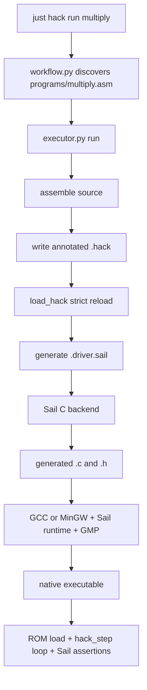
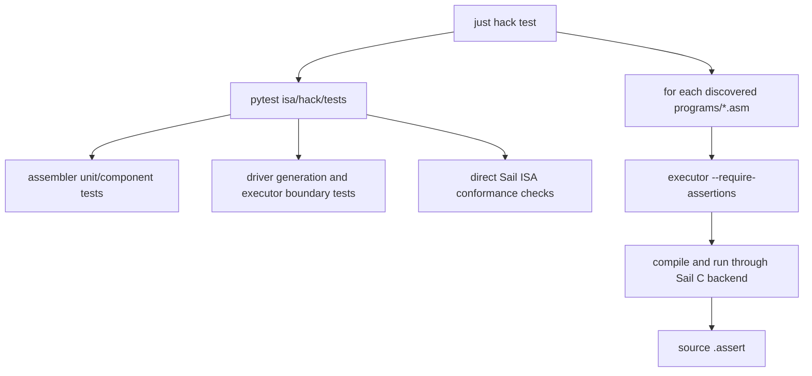

# Hack Execution and Test Workflow

[← Assembler internals](/hack/assembler) · [Common teaching contract](/reference/teaching-contract) · [中文](/zh/hack/execution)

This guide follows [`executor.py`](https://github.com/VIDLG/verylogic-workspace-sail/blob/main/isa/hack/tools/executor.py) and [`workflow.py`](https://github.com/VIDLG/verylogic-workspace-sail/blob/main/isa/hack/tools/workflow.py) to explain how Hack machine code becomes a native executable through Sail's C backend, and how unit, ISA conformance, and assembly integration tests form one regression loop.

## Responsibility boundaries

| File | Responsible for | Not responsible for |
| --- | --- | --- |
| `hack.sail` | ROM storage, raw-word fetch, A/C decode, typed `hack_step()`, ALU, registers, RAM, and PC transitions | Loading a particular program image, a program-specific `main()`, test program discovery |
| `artifact.py` | Runtime override serialization, opening manifest-block creation, atomic `.hack` writing, strict loading, and Hack-specific manifest/completion validation | Instruction parsing, driver policy, or model semantics |
| `executor.py` | Staged driver generation, raw ROM loading, run control, Sail/C compilation, assertions, execution, and closure publication | A/C decoding, program discovery, and batch-test policy |
| `workflow.py` | Source discovery and `check/assemble/run/test/clean` orchestration | ISA semantics and judging machine state itself |

This split keeps `hack.sail` reusable as an ISA model. Running another Hack program requires another generated ROM loader and driver, not a change to fetch, decode, or CPU semantics.



## Why `hack.sail` has no `main()`

The ISA owns the architectural ROM and answers how one step fetches a raw word, decodes it, and changes architectural state. A runnable program must additionally define:

- which raw machine words to load into ROM;
- when execution is complete;
- which final assertions to check;
- which state to print.

Those program-specific answers do not belong in the ISA. `executor.write_driver()` generates a small Sail `main()` for each `.hack` artifact; it loads the image into model-owned `ROM`, then supplies run control around `hack_step()`.

This resembles a real system boundary: a CPU model defines storage, fetch, decode, and instruction behavior, while a loader or simulator supplies the program image and run-control policy.

## Full `executor.run()` sequence

```text
1. Validate CLI arguments
2. assemble(program) into AssemblyResult
3. Resolve effective `max_steps` with CLI > source > default
4. Enforce assertion and ROM-size preconditions
5. Create a temporary sibling staging directory
6. write_hack() to the staged <output>.hack
7. Strictly reload it with load_hack()
8. Generate the staged <output>.driver.sail from LoadedHack
9. Generate staged C/header with Sail
10. Link the staged native executable with Sail runtime and GMP
11. Run the staged executable and its Sail assertions
12. Publish the complete staged closure to the final paths
```

Steps 6 and 7 are the persisted trust boundary: effective CLI overrides are serialized into `.hack` before driver generation. Step 12 is the publication boundary: final names change only after staged execution succeeds. See [Why `load_hack()` exists](/hack/assembler#why-load_hack-exists) and the [common publication contract](/reference/teaching-contract#staging-and-publication).

### Which settings belong on which surface

| Concern | Source | CLI | Reason |
| --- | --- | --- | --- |
| Step budget | `.max_steps` | `--max-steps` | Per-run runtime strategy |
| Description | `.description` | None | Discovery identity and manifest content |
| Checks | `.assert` | None | Source-owned regression contract |
| Artifact comments | None | `--comments` | Host presentation only |
| Output prefix | None | `--output` | Host filesystem policy |
| Assertion requirement | None | `--require-assertions` | Workflow/test gate |

Thus CLI coverage is intentional rather than mechanical: only runtime settings use `CLI > source > default`. CLI cannot silently replace source assertions or descriptions.

## Build artifacts

For `multiply`, the output prefix is:

```text
isa/hack/.build/multiply
```

The executor can generate:

| Artifact | Producer | Purpose |
| --- | --- | --- |
| `multiply.hack` | `write_hack()` | Stable machine-word and metadata boundary |
| `multiply.driver.sail` | `write_driver()` | Program-specific ROM load lines, run control, assertions, and output |
| `multiply.c` | Sail C backend | C implementation of ISA + driver |
| `multiply.h` | Sail C backend | Declarations for generated C |
| `multiply.exe` on Windows or `multiply` on Linux | C compiler | Final native program |

A complete `run` creates these files under a temporary sibling directory, compiles and executes them there, and publishes the whole closure only after execution and assertions succeed. Backup-and-replace publication restores previous destinations if installation fails; a failed staged build or run leaves the previously published closure intact.

## `LoadedHack` is the real executor input

After reload, the object contains only:

```python
@dataclass(frozen=True)
class LoadedHack:
    words: list[int]
    metadata: AssemblyMetadata
    word_comments: tuple[str | None, ...]
    manifest: HackManifest
```

There is no parser AST, symbol table, or hidden Python assembly state. Driver behavior can come only from:

- machine words in `.hack`;
- structured metadata at the top of `.hack`;
- optional per-word teaching comments reloaded from `.hack`;
- fixed `hack.sail` semantics.

Here, the loader means the host-side Python artifact loader `isa/hack/tools/artifact.py::load_hack()`, not generated `load_program()` or the Sail model's `fetch_hack()`. The artifact loader and driver do not consume every manifest field in the same way:

| Manifest data | Consumer and effect |
| --- | --- |
| `completion` | `artifact.py` validates `lowered-self-loop`, word addressing, sorted/ranged addresses, and the actual `@address; 0;JMP` words. Its addresses become `AssemblyMetadata.halt_addresses`; `executor.py` emits `lowered_halt_n` constants and completion checks from them. |
| `runtime.max-steps` | Reloaded into `AssemblyMetadata.max_steps`; `executor.py` emits `driver_max_steps`. |
| `assertions` | Canonicalized and reloaded into `AssemblyMetadata.assertions`; `executor.py` emits Sail assertions. |
| `comments` | Controls strict word-comment layout and must match the requested driver presentation level. |
| `isa`, `profile`, `isa-metadata` | `load_hack()` checks that the artifact's `hack/standard` identity and constants exactly match the selected model, and rejects tampering or mismatches. They do not generate driver constants; `loaded_rom_words` comes from the actual reloaded word count, while architectural widths and capacities belong to `hack.sail`. |
| `source`, `description` | Used for identity and human preambles, not execution semantics. |
| `provenance` | Omitted for direct Hack assembly because there is no extra frontend transformation lineage. |

## How the driver loads model-owned ROM

`hack.sail` owns the complete architectural instruction memory and raw fetch operation:

```ocaml
register ROM : vector(32768, word)

function fetch_hack(pc : program_counter) -> word =
  ROM[unsigned(pc)]
```

`fetch_hack(pc)` returns the raw 16-bit `word`; it does not decode it. The model's `hack_step()` composes the architectural path:

```text
fetch_hack(PC) -> decode_hack(word) -> execute(decoded instruction) -> typed step result
```

`write_driver()` no longer emits `instruction_at`, `execute_at`, or an address-to-decode `match`. It emits a `load_program()` function containing raw assignments instead:

```ocaml
function load_program() -> unit = {
  ROM[0] = 0b0000000000000110; // ROM[0000] L4 [1/4] SET R0, 6 => @6
  ROM[1] = 0b1110110000010000; // ROM[0001] L4 [2/4] SET R0, 6 => D=A
  // ...
}
```

Python only reloads words and writes these ROM load lines. It never decodes A- or C-instructions; legality, decode, and execution remain in Sail. `hack_step()` returns a typed result, and generated `main()` matches that result directly: a retired step continues, while an illegal encoding becomes an explicit driver assertion failure.

The same `none / summary / full` level used for `.hack` controls driver comments. At the default `summary`, each `ROM[index] = word` line carries normalized assembly source, Hack+ words also carry `[i/n] source => canonical`, and inline assembly comments stay at the far right. `full` adds exact original source text and expands the explanations for assertion sources and final output. These comments come from `LoadedHack.word_comments`, proving they survived the file boundary.

`load_program()` writes only the loaded image. Generated `main()` calls `execution_should_continue(PC, steps)` before each attempt, so it never calls `hack_step()` beyond the program's loaded ROM extent.

## How the driver stops and validates completion

The generated driver centralizes the subtle run condition in one small function:

```ocaml
let lowered_halt_0 : program_counter = 0b000000000110011
let driver_max_steps : int = 100000

function execution_should_continue(pc : program_counter, steps : int) -> bool = {
  (pc != lowered_halt_0)
  & unsigned(pc) < loaded_rom_words
  & steps < driver_max_steps
}
```

The loop itself stays direct:

```ocaml
while execution_should_continue(PC, steps) {
  // one checked hack_step
}
```

`loaded_rom_words` is generated from the reloaded artifact's word count—for `basic_alu` it is `53`, covering ROM addresses `0..52`. It is not `max_steps` and does not limit how many times a loop may revisit those addresses. Each `lowered_halt_n` value comes from `completion.addresses` in the reloaded opening `//%` manifest block; the bit pattern has no special meaning in the Hack ISA.

The condition becomes false in three cases, which the driver distinguishes after the loop:

1. `PC` reaches a HALT address recorded in `.hack` metadata: valid completion;
2. `PC` leaves the loaded ROM image: explicit execution error;
3. `steps` reaches `driver_max_steps`: valid only for an explicitly requested bounded snapshot, otherwise watchdog failure.

### Why the HALT loop does not execute here

Hack+ `HALT` lowers to:

```asm
(HALT_PRIVATE)
@HALT_PRIVATE
0;JMP
```

Metadata records the private-label address. The driver sees completion when `PC` reaches that address and exits before executing the loop. The two loop words remain in `.hack`, so the artifact is still a legal native Hack program that would stay in its self-loop.

This is deliberately driver policy. Standard Hack has no encoded HALT instruction: Hack+ `HALT` is an assembler convenience, ROM end comes from the loaded artifact, and neither is an architectural outcome from `hack.sail`. If the ISA later gains a real HALT opcode, decoding and returning that outcome would belong in the model.

### The 32768-word ROM edge case

`PC` is 15 bits and cannot exceed `32767`. For a completely full 32768-word image, `PC >= loaded_rom_words` can never become true: there is no representable “one past the ROM” address. A recorded `HALT` can complete such a program normally; otherwise the explicit or default step budget still bounds the host run and fails as a watchdog unless the source explicitly requests a bounded snapshot.

## Generated run loop

The generated `main()` loads raw words, executes checked model steps under completion and watchdog control, then evaluates source assertions:

```ocaml
load_program();
var steps : int = 0;
while execution_should_continue(PC, steps) {
  match hack_step() {
    HackRetired(()) => (),
    HackIllegalInstruction(_) => assert(false, "illegal Hack instruction encoding")
  };
  steps = steps + 1
};
assert (unsigned(PC) < loaded_rom_words,
        "program counter left the loaded ROM image");
// source assertions
```

The driver owns completion checks, watchdog enforcement, source assertions, and final output. Fetch, decode, and execute remain one model-owned `hack_step()`; generated `main()` only turns its typed result into driver policy.

## Two meanings of `max_steps`

The effective limit has this precedence:

```text
CLI --max-steps > source .max_steps > default watchdog (100000)
```

A CLI value replaces source `.max_steps` in the generated `.hack` metadata before strict reload. The generator then emits `driver_max_steps` from reloaded metadata, or uses the default for normal executor runs; `execution_should_continue` requires `steps < driver_max_steps`. This guarantees a finite host run even when a program loops forever without reaching lowered HALT metadata.

### Watchdog mode

If a program has HALT, reaching the limit requires that `PC` has already reached one of its generated `lowered_halt_n` values:

```ocaml
assert ((PC == lowered_halt_0),
        "maximum step limit reached before lowered HALT")
```

For a program with no HALT and no explicitly requested bounded snapshot, budget exhaustion instead raises `maximum step limit reached without lowered HALT or an explicit bounded snapshot`. In both cases the meaning is: “the limit prevents an infinite host run; exhausting it is not successful completion.”

### Deliberately bounded snapshot

If a program has:

- no HALT;
- at least one `.assert`;
- an explicitly configured source `.max_steps` or CLI `--max-steps` value;

then the limit means “run N retired instructions and inspect state.” If execution remains within the loaded image and does not fault, the driver executes exactly N steps and then checks the assertions without requiring lowered-HALT completion.

This is useful for loop snapshots, but terminating programs should prefer `HALT` because it expresses completion more directly.

## Turning source assertions into Sail

The assembler canonicalizes `.assert` into `Assertion`; the executor emits the actual Sail expression.

### Target mapping

```text
R0  -> RAM[0]
R15 -> RAM[15]
A   -> A
D   -> D
PC  -> PC
RAM[100] -> RAM[100]
```

### Comparison modes

| Source | Generated meaning |
| --- | --- |
| `R0 == -1` | `RAM[0] == 0xFFFF`, bit exact |
| `R0 != 0` | `RAM[0] != 0x0000`, bit exact |
| `signed(R0) < -1` | `signed(RAM[0]) < -1` |
| `unsigned(R0) > 32768` | `unsigned(RAM[0]) > 32768` |
| `unsigned(PC) >= 10` | `unsigned(PC) >= 10` |

Equality and inequality always compare architectural bits and reject any `signed(...)` or `unsigned(...)` wrapper. Ordered operators require one of those wrappers explicitly. The common parser enforces that distinction before Hack validates `A`, `D`, `PC`, `R0..R15`, or `RAM[index]`.

Failure messages retain the assembly source line:

```text
assertion signed(R0) < -1 from source line 23 failed
```

A runtime failure can therefore lead back to `.asm`, rather than only to generated driver code.

## Sail-to-native compilation

`compile_and_run()` performs three stages.

### 1. Ensure project-local Sail

```python
sail = install_sail.ensure_installed()
```

This selects and validates the pinned official binary under `.pixi/sail/`; it does not fall back to arbitrary system Sail.

### 2. Generate C with Sail

Conceptually:

```sh
sail -c -o <output-prefix> \
  isa/hack/hack.sail \
  <output-prefix>.driver.sail
```

Sail type-checks both sources together and emits `<output>.c` and `<output>.h`.

### 3. Compile, link, and run

Platform compiler:

- Windows: `x86_64-w64-mingw32-gcc`;
- Linux: `gcc`.

Link inputs include:

- Sail-generated C;
- Sail runtime components `rts`, `elf`, `sail`, `sail_config`, `sail_failure`, and `cJSON`;
- `support/sail_windows_compat.c` and its forced-include header;
- GMP through `-lgmp`.

The Pixi/Conda prefix locates GMP headers and libraries. After a successful link, the executor starts the native program immediately. Every subprocess uses `check=True`, so a nonzero exit propagates as failure.

## What generated `main()` prints

After execution and successful assertions, the driver:

1. prints `ASSERT PASS` when assertions exist, otherwise `RUN COMPLETE`;
2. prints `A`, `D`, and `PC`;
3. prints `R0..R7`.

These registers are a human-readable summary, not the test oracle. Sail `assert` and process exit status determine success; workflow does not scrape console output to guess whether a program passed.

## `workflow.py` as the control plane

Workflow answers which repository example a command names and which tool to invoke. It does not execute ISA semantics.

### Source-based program discovery

`discover_programs()` scans direct program sources matching:

```text
isa/hack/programs/*.asm
```

Files are sorted by filename, and the filename stem becomes the command name. For example, `multiply.asm` is selected by `just hack run multiply`.

Every bundled source must contain exactly one nonempty description directive:

```asm
.description Repeated-addition multiplication: 6 times 7
```

The assembler parser validates `.description`, `source_description()` exposes it to workflow discovery, and `assemble_text()` stores it in `AssemblyMetadata`. `artifact.py` serializes the same text as manifest `description`; it emits no machine word.

`discover_programs()` additionally verifies that each file resolves inside the Hack package and actually exists. Direct `glob("*.asm")` intentionally ignores nested directories and non-assembly files.

### Action dispatch

| Action | Workflow behavior |
| --- | --- |
| `list` | Discover and print every direct `programs/*.asm` source |
| `check` | Ensure Sail, then run `sail --just-check hack.sail` |
| `assemble NAME` | Invoke assembler CLI and write `.build/NAME.hack` atomically |
| `run NAME` | Invoke executor CLI for assemble, generation, compile, and run |
| `test` | Run package Pytest, then integration-run every discovered source |
| `clean` | Recreate `.build/` containing only `.gitkeep` |

`isa/hack/justfile` exposes these actions directly as `just hack ...` recipes. The root `test` and `clean-all` recipes aggregate the module commands.

## What `just hack test` verifies



### Layer 1: assembler tests

`test_assembler.py` covers parsing, lowering, encoding, metadata round trips, and malformed-input rejection. It runs quickly without compiling a native program for every assertion.

### Layer 2: executor component tests

`test_executor.py` calls `write_driver()` and inspects generated Sail to fix:

- raw `ROM[index] = word` loading;
- checked `hack_step()` dispatch and explicit loaded-image boundary failure;
- bounded-loop behavior;
- bit-exact, signed, unsigned, and PC assertions;
- reloaded metadata as the source of truth.

Some tests monkeypatch native compilation to isolate Python boundary behavior.

### Layer 3: discovered-program end-to-end tests

Workflow invokes every discovered program with:

```text
executor.py ... --require-assertions
```

An example without `.assert` fails immediately, preventing bundled sources that merely run without verifying anything.

### Layer 4: direct Sail ISA conformance

`tests/isa_conformance.sail` directly checks `alu()`, `should_jump()`, and `execute()`, covering ALU operations, the jump truth table, destination masks, old-`A` behavior, and PC wraparound. This layer tests Sail ISA functions independently of the generated-driver integration path.

### Repository-wide tests

```sh
pixi run just test
```

First runs global tool tests such as `tests/test_install_sail.py`, then invokes `just hack test`. Future ISA modules should be aggregated at the root without teaching the root workflow Hack executor internals.

## Debugging a failed run

Follow artifact boundaries from front to back:

1. **Source error**: inspect assembler `line N` diagnostics.
2. **Encoding error**: run `just hack assemble NAME` and inspect the source annotations beside `.hack` words.
3. **Metadata error**: inspect the opening `//%` manifest block in `.hack`.
4. **Driver error**: open `.driver.sail` and inspect `load_program()` ROM lines, checked-step run control, and assertions.
5. **Sail type error**: read Sail `-c` output directly.
6. **C build error**: verify compiler, runtime include path, GMP, and compatibility layer.
7. **Architectural assertion failure**: use the `.asm` line in the message and final register summary.
8. **Batch workflow failure**: run one `just hack run NAME` before debugging source discovery or batch orchestration.

Do not start by adding prints to `workflow.py`. It usually propagates a lower-layer error; the strongest evidence is more likely at the `.hack`, `.driver.sail`, or generated-C boundary.

## Function reading order

### Executor

1. `run`
2. `write_driver`
3. `_assertion_expression`
4. `compile_and_run`
5. `main`

### Workflow

1. `discover_programs`
2. `selected_program` / `source_path`
3. `assemble` / `run`
4. `test`
5. `main`

## Suggested exercises

### Exercise 1: read a generated driver

```sh
pixi run just hack run multiply
```

Open `isa/hack/.build/multiply.driver.sail` and locate:

- the `ROM[0] = word` load line;
- the HALT address;
- the generated run loop and checked `hack_step()` call;
- the Sail assertion corresponding to `R2 == 42`;

### Exercise 2: write a bounded program

Create a self-loop without `HALT`, add `.max_steps 10` and a final `.assert`. Predict the generated loop and limit checks, then compare with the real `.driver.sail`.

### Exercise 3: distinguish test layers

Deliberately introduce, one at a time:

1. an invalid assembly mnemonic;
2. an incorrect `.assert` expected value;
3. a Sail type error in a generated driver;
4. a missing or duplicate `.description` in one bundled source.

Observe which layer catches each error. A clear toolchain should fail as close as possible to the root cause.

---

Return to the [Hack overview](/hack/) or open the [Hack package reference](https://github.com/VIDLG/verylogic-workspace-sail/blob/main/isa/hack/README.md).
