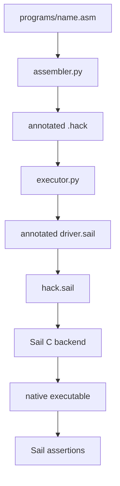

# Hack with Sail

Hack is the 16-bit teaching computer from nand2tetris. This module turns its instruction-set specification into an executable Sail model, then surrounds that model with an assembler, runnable programs, assertions, and regression tests.

## Run it first

Clone the repository, open its root directory, and run:

```sh
git clone https://github.com/VIDLG/verylogic-workspace-sail.git
cd verylogic-workspace-sail
pixi run just hack list
pixi run just hack run multiply
```

A successful program ends with `ASSERT PASS` and a dump of architectural state. The [tutorial](/hack/tutorial) explains the output and follows the same program through every toolchain stage.

## Choose by goal

| If you want to understand… | Read |
| --- | --- |
| where Hack and Sail come from, and how to run a first program | [Tutorial](/hack/tutorial) |
| registers, memory, instruction bits, ALU operations, and jumps | [ISA guide](/hack/isa) |
| how to add pseudoinstructions, tools, devices, or real ISA extensions | [Evolve Hack](/hack/evolution) |
| symbols, Hack+ lowering, two-pass assembly, and `.hack` output | [Assembler internals](/hack/assembler) |
| generated drivers, Sail's C backend, assertions, and tests | [Execution and tests](/hack/execution) |
| exact commands, directives, and artifact comment levels | [Package reference](https://github.com/VIDLG/verylogic-workspace-sail/blob/main/isa/hack/README.md) |

## One program, end to end



The machine contract belongs to `hack.sail`; source translation belongs to the assembler; driver generation and native compilation belong to the executor; program discovery and command dispatch belong to workflow.

## Suggested learning sequence

1. Complete the [tutorial](/hack/tutorial) and inspect `multiply.asm`.
2. Read the [ISA guide](/hack/isa) while following `hack.sail`.
3. Use [Evolve Hack](/hack/evolution) to choose and specify a modification at the correct layer.
4. Enter **Toolchain internals** and follow the same source through the [assembler](/hack/assembler).
5. Finish with the [execution and test workflow](/hack/execution).
