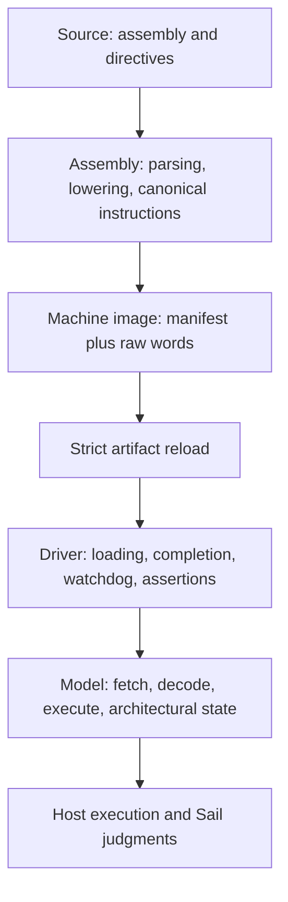

# Common Teaching Contract

[Documentation home](/) · [中文](/zh/reference/teaching-contract) · [Hack assembler](/hack/assembler)

ISA packages share a small public contract for source directives, runtime-setting resolution, annotated machine-image identity, explanatory comments, and publication. Each ISA still owns its instruction syntax, assertion targets, encoding, completion convention, and Sail semantics.

## The five-layer boundary



| Layer | Owns | Must not own |
| --- | --- | --- |
| Source | program text, `.description`, `.max_steps`, and `.assert` | encoded words or generated driver policy |
| Assembly | source locations, labels, pseudoinstruction lowering, canonical instructions, and machine-word records | final architectural state or assertion evaluation |
| Machine image | raw words and the effective execution contract in an opening `//%` manifest | hidden parser objects or unrecorded CLI overrides |
| Driver | loading raw words, completion/watchdog policy, assertions, and diagnostic output | decoded constructors, fetch/decode semantics, or ISA state transitions |
| Model | architectural storage, raw fetch, decode, execute, typed outcomes, and a composed step function | source discovery, artifact publication, or program-specific `main()` policy |

The persisted machine image is the trust boundary. Driver generation consumes a strict reload of the generated artifact, never a richer in-memory assembler result.

## Public source directives

The shared parser recognizes three public directives after ISA comment stripping:

```asm
.description A nonempty one-line description
.max_steps 1000
.assert TARGET == 42
.assert signed(TARGET) < 0
.assert unsigned(TARGET) >= 10
```

- `.description TEXT` may appear at most once. Bundled-program discovery can require it, and artifacts retain it.
- `.max_steps POSITIVE_INT` may appear at most once. It supplies the source candidate for runtime resolution.
- `.assert ...` may appear multiple times. It emits no instruction and becomes a source-located assertion in the manifest.

Lines outside these forms remain ISA-owned, so the common parser does not absorb assembly syntax or pseudoinstructions.

## Assertion syntax and interpretation

### Equality is bit-exact

`==` and `!=` compare the target's architectural bit pattern and require an unwrapped target:

```asm
.assert R0 == -1
.assert PC != 10
```

The ISA validates the target width and canonicalizes an accepted integer spelling to the corresponding unsigned bit pattern. Equality wrappers are rejected because signedness cannot change bit equality:

```asm
.assert signed(R0) == -1       // invalid
```

### Ordered comparisons require an explicit mode

`<`, `<=`, `>`, and `>=` must state how to interpret the bits:

```asm
.assert signed(R0) < 0
.assert unsigned(PC) >= 10
```

The shared parser owns directive shape, integer syntax, equality-wrapper rejection, and the explicit-mode rule. The selected ISA owns target canonicalization, aliases, widths, ranges, alignment, and the generated Sail expression. Strict artifact loading repeats ISA validation so hand editing cannot bypass source checks.

## Runtime resolution: CLI > source > default

Runtime settings use one precedence:

```text
CLI override > source directive > package default
```

The selected value and origin are serialized before strict reload:

```lisp
(runtime (max-steps 2000 cli))
```

The driver reads only the reloaded effective value. CLI state never bypasses the image as a hidden driver-generation argument.

## Opening artifact manifest block

Every generated annotated machine image begins with exactly one contiguous `//%` manifest block. Its payload is one canonical restricted S-expression. At `summary` and `full`, the form is indented across consecutive prefixed lines; at `none`, the same form is compacted onto one prefixed line.

```text
//% (artifact
//%   (schema "verylogic.annotated-image")
//%   (version 1)
//%   (isa hack)
//%   (profile standard)
//%   (source asm "programs/example.asm")
//%   (comments summary)
//%   (runtime (max-steps 1000 source))
//%   (assertions
//%     (assert (= R0 7) (source-line 12))
//%   )
//%   (completion lowered-self-loop word 12)
//%   (isa-metadata
//%     (object
//%       (address-bits 15)
//%       (ram-words 32768)
//%       (rom-words 32768)
//%       (word-bits 16)
//%     )
//%   )
//% )
```

This is data, not executable Lisp or Sail. The repository subset permits symbols, UTF-8 quoted strings, decimal integers, and proper lists. It rejects floats, reader abbreviations, dotted pairs, vectors, keywords, reserved `nil`/`t`, duplicate or unknown fields, and non-canonical formatting. Generic nested data uses explicit `(object ...)` and `(array ...)` forms plus `none`, `true`, and `false`.

The common envelope records schema/version, ISA/profile, safe source identity, optional description, comment level, resolved runtime values and origins, canonical assertions, optional non-empty frontend provenance, completion metadata, and ISA metadata. Pydantic models validate the exact persisted shape; ISA artifact code retains context-dependent checks such as profile equality, target canonicalization, address validity, and completion-word binding.

## Explanatory levels: `none`, `summary`, `full`

The manifest exists at every level. Only human explanation changes:

| Level | Human-readable content |
| --- | --- |
| `none` | one compact manifest line followed by raw words |
| `summary` | formatted manifest, concise preamble, and one useful source-to-word mapping per word |
| `full` | summary identity plus expanded assertion and per-word provenance details |

Changing the level must not change words, assertions, runtime values, completion, or ISA identity.

## Staging and publication

Single generated images use temporary sibling files for atomic replacement. Multi-file artifact closures use backup-and-replace publication with rollback if installation fails. If recovery itself cannot complete, publication reports an explicit incomplete-rollback error and retains any surviving backup rather than deleting the only recoverable copy.

A complete executor run assembles, strictly reloads, generates the driver, compiles Sail and host code, executes the staged native program, and checks Sail assertions in a temporary sibling directory. Only successful staged execution publishes the machine image, driver, generated C/header, and executable. Assembly, loading, compilation, execution, or assertion failure leaves the previous successful closure in place.

These are process-level replacement and rollback guarantees, not a claim of crash consistency across machine or filesystem failure.

## Shared mechanism, ISA-owned policy

`tools/isa_support` owns directive grammar, canonical manifest primitives, restricted S-expression parsing/rendering, process execution, host compilation, and rollback-capable publication. It does not import an ISA. Each ISA package owns assembly syntax and lowering, target validation, image-specific checks, driver templates, completion policy, and tests.
