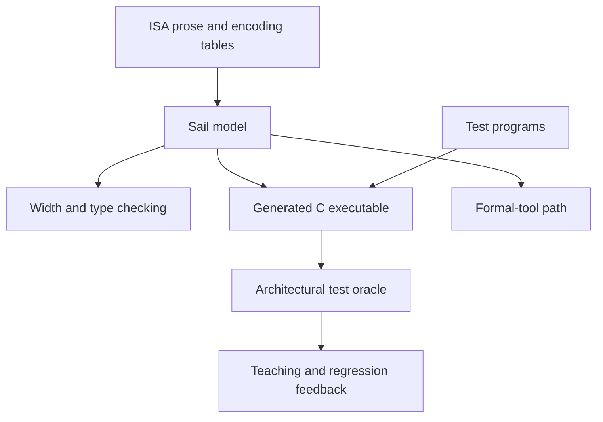

# Why This Workspace Uses Sail

[Documentation home](/) · [中文](/zh/why-sail) · [Start with Hack →](/hack/)

An instruction-set architecture is a contract between software and a processor implementation. It defines instruction encodings, architectural state, and the state transition caused by each instruction. It does **not** prescribe one pipeline, circuit, simulator, or proof technique.

Sail fits this boundary unusually well: it is precise enough to execute and check, but remains close to the pseudocode and encoding tables people expect in an ISA manual. This workspace therefore uses Sail as the source of truth for ISA behavior, while keeping assemblers, program drivers, generated C, and hardware implementations in their proper layers.

## What an ISA description must do

For this workspace, a useful ISA description should:

1. make instruction bits and fixed-width values explicit;
2. state architectural effects without committing to a microarchitecture;
3. be readable during teaching and review;
4. execute as a reference model rather than remain only prose;
5. support tests from the same semantics readers inspect;
6. leave a path to code generation and formal tools without maintaining another hand-written model.

No notation wins every category. Sail is the best center of gravity here because it covers all six at once.

## The alternatives solve different problems

| Expression | Best at | What is missing when used as the ISA source of truth |
| --- | --- | --- |
| Prose and encoding tables | Publishing an approachable architecture manual | Ambiguities and omissions are not executable; examples and implementations can drift |
| C or C++ reference emulator | Fast execution, debugger and device ecosystems, production simulation | ISA structure, bit widths, and encoding relations often live in conventions and helper code rather than the language's model |
| Verilog/SystemVerilog or another HDL | RTL, clocks, pipelines, interfaces, synthesis, and implementation verification | Microarchitectural detail is mixed with software-visible behavior, although many implementations may implement the same ISA |
| Ad hoc Python/Rust/DSL model | Rapid prototypes and project-specific integration | The project must build and maintain its own ISA types, validation, documentation, and analysis ecosystem |
| Coq, Isabelle, Lean, or HOL | Machine-checked definitions and deep proofs | A larger proof-engineering entry cost for readers who first need to run and understand an ISA |
| Sail | Executable, typed ISA semantics with reusable backends | It is not RTL, a cycle-accurate simulator, or a proof by itself |

The comparison is about **fitness for the ISA layer**, not whether Sail is universally better than these languages.

## Compared with Verilog and SystemVerilog

An HDL describes a hardware realization: registers updated on clock edges, combinational paths, pipeline stages, stalls, buses, and implementation interfaces. Those details matter when building a core, but they are intentionally below the ISA contract. An interpreter, an in-order core, and an out-of-order core can all implement the same instruction behavior.

Using RTL as the only architectural specification creates two problems:

- the meaning of one instruction is distributed across decode, pipeline, forwarding, exception, and commit logic;
- implementation choices can be mistaken for architectural requirements.

Sail instead lets an instruction read like one architectural transition. Its `mapping` construct can place encoding and decoding together, while fixed-width bitvectors make field sizes part of the checked model. RTL can then be tested against that independent reference.

This is a complement, not a replacement. Use Verilog/SystemVerilog to answer **how this processor is built and timed**. Use Sail to answer **what every compliant processor must make software observe**. In the Hack learning path, nand2tetris HDL remains the right tool for gates and chips; `hack.sail` starts at the next abstraction boundary.

## Compared with C or C++

A hand-written C or C++ emulator can be fast and can integrate with mature operating-system, debugger, and device infrastructure. It is often the right implementation artifact. The difficulty is using it as the primary specification:

- fixed-width relationships and signedness depend on disciplined use of host-language types and helpers;
- decoding and encoding are commonly separate functions that must be kept consistent;
- optimizations, caches, devices, and control flow can obscure the architectural rule being specified;
- a prose manual, emulator, and formal model can become three independently maintained meanings of the ISA.

Sail moves those concerns into an ISA-oriented language. Numeric and bitvector widths participate in type checking, instruction forms are explicit data, and bidirectional mappings can connect those forms to machine words. The same model can then generate C for execution. In other words, this workspace still benefits from C as a runtime target without making hand-written C the semantic source.

Generated C is not automatically fast enough for every production emulator, nor does it supply a complete system around the CPU. A tuned C/C++ simulator remains appropriate when throughput, timing models, binary translation, or a large device ecosystem is the primary requirement.

## Compared with prose and pseudocode

Prose explains motivation, exceptions, and intent better than source code. Encoding diagrams are excellent lookup tools. Both remain necessary documentation.

They are weak test oracles, however. Terms such as “the old register value,” overflow behavior, legal field widths, and the order of simultaneous effects can be interpreted differently by different implementers. Vendor pseudocode improves structure but is useful as an executable standard only when its language and tooling are precisely defined.

Sail does not eliminate prose. It gives prose an executable companion: readers can inspect a compact transition, the type checker can reject inconsistent widths, and tests can run against that exact transition. Documentation should explain the model; it should not silently become a second model.

## Compared with a proof assistant

A direct definition in Coq, Isabelle, Lean, or HOL is a strong foundation when the main goal is machine-checked proof. It can also demand substantial proof-language and library knowledge before a contributor can execute a first program or change an instruction.

Sail occupies a pragmatic middle ground. Its surface language is designed for architecture engineers, its models execute, and its toolchain can produce definitions for theorem-proving backends. That creates a route from an engineer-facing model to formal reasoning.

The boundary is important: type checking is not proof of ISA correctness, generated theorem-prover definitions are not completed proofs, and this workspace currently makes no formal-verification claim for its Hack model.

## Why Sail is a good fit here

The Hack model demonstrates the properties this workspace wants future ISA modules to preserve:

- **The code resembles the contract.** Instruction forms, encodings, registers, and transitions are visible rather than hidden in framework machinery.
- **Bit-level mistakes become checkable.** `bits(n)` and related numeric constraints express facts that comments in a general-purpose language cannot enforce.
- **One model is both readable and runnable.** The C backend turns the inspected semantics into the executable used by tests.
- **Tests judge architectural state in Sail.** Python coordinates tools, but it does not reimplement Hack execution.
- **The model stays independent of one implementation.** The same semantics can serve teaching, software bring-up, RTL comparison, and future formal work.
- **There is evidence beyond a toy ISA.** The Sail project publishes models and tooling for architectures including RISC-V, Arm-derived models, MIPS, x86 fragments, and CHERI variants.

## What choosing Sail does not mean

Choosing Sail does not make every file a Sail file or collapse every abstraction into the ISA model.

| Concern in this workspace | Owner | Why |
| --- | --- | --- |
| Instruction encoding and architectural transitions | Sail model | This is the ISA contract |
| Assembly syntax, labels, and pseudoinstruction lowering | Python assembler | These are source-language concerns |
| Program loading, bounds, and generated `main()` | Executor and Sail driver | These vary by program and platform |
| Native compilation | Sail C backend and host C compiler | C is the execution target, not a second hand-written ISA |
| Gates, timing, and pipelines | An HDL project, if added | These are implementation concerns |
| Explanations and learning sequence | Documentation | Prose teaches intent and context |

Sail also has real costs: it is a specialized language, its ecosystem is smaller than C/C++ or SystemVerilog, editor support is less mature, and some backends or large models require specialist knowledge. This repository mitigates setup cost by pinning Sail and wrapping common tasks, but it should not hide those tradeoffs.

## A practical decision rule

Choose the primary representation by the question you need to answer:

- **What must an instruction mean on every implementation?** Start with Sail.
- **How should a person learn or look up the architecture?** Write prose and diagrams beside the Sail model.
- **How is this core implemented cycle by cycle?** Use an HDL.
- **How do we run a highly optimized full-system simulator?** Use a simulator framework or tuned C/C++, with the Sail model as a possible oracle.
- **How do we prove a security or correctness theorem?** Use Sail's formal backends where suitable, or define the model directly in a proof assistant when that is the better proof-engineering choice.

For this educational workspace, the central question is the first one. That is why Sail sits at the center, with the other representations connected around it rather than treated as competitors to eliminate.

## Further reading

- [Sail project and capability overview](https://github.com/rems-project/sail)
- [Sail Language Reference](https://alasdair.github.io/manual.html)
- [Detailed Models of Instruction Set Architectures: From Pseudocode to Formal Semantics](https://doi.org/10.1145/3290384)
- [See the choice applied to Hack →](/hack/tutorial)
