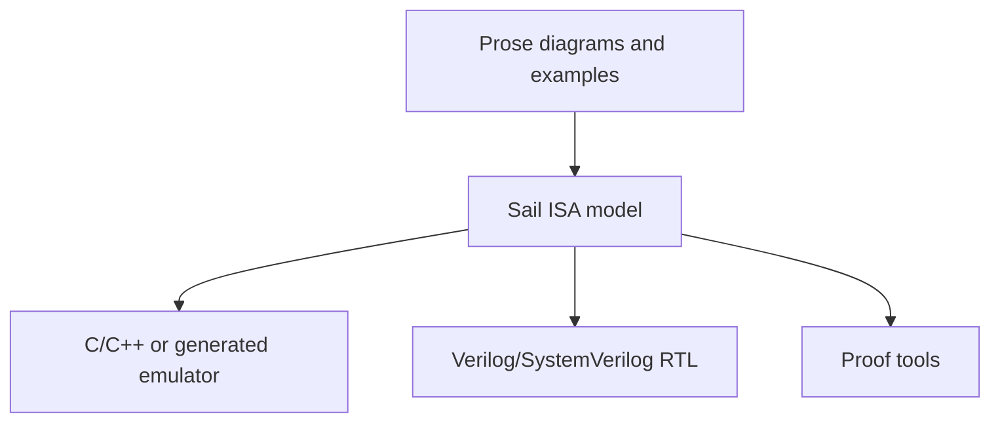

# Why This Workspace Uses Sail

[Documentation home](/) · [中文](/zh/why-sail) · [Start with Hack →](/hack/)

A single instruction may sound simple: read some values, compute a result, and write it back. Describing a complete instruction set quickly adds more questions. How is a machine word divided into fields? How wide is each value? Does an operation use old or new state? How does arithmetic truncate? When is an exception taken? How can different implementations check that they mean the same thing?

That is necessary ISA complexity; it cannot be removed. The problem is that an ill-fitting notation adds another layer of complexity that readers must cross before they can see the machine rules themselves.

> **Sail does not make the ISA itself simple. It keeps the complexity at the ISA layer.**

It preserves encodings, architectural state, and state transitions while avoiding most details of a host language, one particular pipeline, or proof-engineering scaffolding. This matters in education: most of the code a student reads should be about the machine, not about the framework used to express it.

## Separate the three layers first



These representations complement rather than eliminate one another. The question is: **which one should be the implementation-independent source of truth in the middle?**

A small Hack example and a realistic RISC-V example make the tradeoff concrete.

## Example 1: where should Hack `AM=D` write memory?

A Hack C-instruction can update `A`, `D`, and memory `M` in one step. For example:

```asm
AM=D
```

It writes `D` to `A` and to RAM. The easy-to-miss rule is that the RAM address must use the **old value of `A` at the start of the instruction**, not the value just written to `A`.

Given this initial state:

```text
A = 100
D = 7
```

execution must produce:

```text
A = 7
RAM[100] = 7
```

not `RAM[7] = 7`.

### Prose: easy to read, and easy to miss one sentence

A manual can say:

> If one instruction writes both A and M, M uses the value of A at the start of the instruction as its address.

That sentence is essential for learning, but it cannot execute itself. An emulator, RTL implementation, and tests must each implement it again. If one of them overlooks “at the start,” the project gains a second meaning of the machine.

### C or C++: statement order quietly becomes semantics

The following is natural sequential code, but it is wrong for Hack:

```c
if (write_a) {
    cpu.A = out;
}
if (write_m) {
    cpu.ram[cpu.A & 0x7fff] = out; // Wrong: this observes the new A
}
```

The fix is straightforward: save `old_a` first. But the specification fact is now hidden among a temporary variable, a mask, and statement ordering. The project must also establish by convention that:

- `A` is 16 bits while a RAM address is 15 bits;
- `out` truncates correctly;
- the decoder produces `write_a` and `write_m` correctly;
- the encoder, disassembler, and emulator agree.

C and C++ can implement the emulator correctly. The languages simply do not know that these pieces form an ISA or check those relationships for the project.

### Verilog or SystemVerilog: implementation details surround the rule

RTL introduces more information that is necessary for hardware but not part of the ISA:

```verilog
always_ff @(posedge clk) begin
  if (reset) begin
    A <= '0;
  end else if (execute_valid && !pipeline_stall) begin
    if (dest_a) A <= alu_out;
  end
end

assign ram_we    = execute_valid && dest_m;
assign ram_addr  = old_a[14:0];
assign ram_wdata = alu_out;
```

Clocks, reset, valid signals, stalls, RAM interfaces, and pipeline placement are real implementation questions, but they are not the architectural meaning of `AM=D`. A non-pipelined core and an out-of-order core will have different RTL while owing software the same result.

RTL is the right answer to “how is this processor built?” It is a poor sole source for “what must every Hack processor do?”

### Sail: almost every line is a machine rule

The shared [`model/core.sail`](https://github.com/VIDLG/verylogic-workspace-sail/blob/main/isa/hack/model/core.sail) model saves old state and then makes each write explicit:

```ocaml
let old_a = A;
let out = alu(comp, D, y);

if dest[2] == 0b1 then A = out else ();
if dest[1] == 0b1 then D = out else ();
if dest[0] == 0b1 then RAM[unsigned(ram_address(old_a))] = out else ();
```

The relevant widths also belong to the model:

```ocaml
type word = bits(16)
type address = bits(15)

register A : word
register RAM : vector(32768, word)
```

The complexity remains, but nearly every line answers an ISA question: what is old state, what is the result, which destinations are written, and how wide is an address? There is no pipeline or clock, and C masks do not have to stand in for architectural types.

## Example 2: RISC-V `ADDI` is more than “one addition”

RISC-V `ADDI` is often summarized as:

```text
x[rd] = x[rs1] + immediate
```

Its actual architectural contract also says that:

1. the instruction is 32 bits and the immediate comes from `inst[31:20]`;
2. the 12-bit immediate is sign-extended to the current XLEN;
3. `rs1` and `rd` are five-bit register identifiers;
4. arithmetic is performed at XLEN and keeps the low XLEN bits;
5. reading `x0` returns zero and writing `x0` has no effect;
6. `funct3` and the opcode must match the `ADDI` encoding.

“One addition” is approachable prose. These details are what make it an executable, testable ISA rule.

### C or C++: conventions rebuild a small bit-level language

An interpreter branch may look like this:

```c
uint32_t rd  = (insn >> 7)  & 0x1f;
uint32_t rs1 = (insn >> 15) & 0x1f;
uint_xlen_t imm = sext12(insn >> 20);
uint_xlen_t result = cpu.x[rs1] + imm;

if (rd != 0) {
    cpu.x[rd] = result;
}
```

It can run correctly, but much of the ISA depends on project-defined conventions:

- whether `uint_xlen_t` is 32 or 64 bits;
- whether `sext12` handles every boundary correctly;
- whether `cpu.x[0]` always remains zero;
- where the opcode and `funct3` checks live;
- whether the encoder performs exactly the inverse bit operations.

A complete project commonly maintains an encoding table, decoder, executor, disassembler, and tests. The problem is not that C cannot express the ISA. It is that **once one architectural fact is scattered across those components, engineering discipline must keep them synchronized**.

### RTL: one processor organization must also be chosen

Once `ADDI` enters RTL, the designer must decide where it decodes, where the immediate is extended, when registers are read, how values are forwarded, when the instruction commits, and what stalls or flushes do. Building a processor requires those answers; the RISC-V ISA does not mandate one answer.

When one core's RTL stands in for the ISA specification, a student often sees pipeline control before seeing the encoding and architectural effect of `ADDI`.

### Sail: encoding, types, and behavior share one language

The upstream Sail project's RISC-V example first defines an instruction form and connects it to a 32-bit machine word:

```ocaml
union clause ast = ITYPE : (bits(12), regbits, regbits, iop)

mapping clause encdec =
  ITYPE(imm, rs1, rd, op)
    <-> imm @ rs1 @ encdec_iop(op) @ rd @ 0b0010011
```

Execution uses the same `imm`, `rs1`, `rd`, and `op`:

```ocaml
function clause execute (ITYPE (imm, rs1, rd, op)) = {
  let rs1_val = X(rs1);
  let immext : xlenbits = EXTS(imm);
  let result : xlenbits = match op {
    RISCV_ADDI => rs1_val + immext,
    /* other I-type operations */
  };
  X(rd) = result;
  true
}
```

The surrounding model still defines `xlenbits`, `X`, and `EXTS`. The difference is that these abstractions remain inside one ISA type-and-state system:

- `bits(12)` states the immediate width;
- `xlenbits` states that the result follows XLEN;
- `EXTS` states that extension is signed;
- `X` centralizes architectural register rules including `x0`;
- `encdec` makes instruction structure and machine encoding one checked relationship.

The reader mostly sees RISC-V rather than a host language or one core's organization.

That upstream example demonstrates Sail's bidirectional `mapping` feature. This workspace uses mappings when the legal encoding is a compact bijection, as in Hack, and wraps them with an explicit decode `match` when illegal prefixes must remain visible. More complex models such as RV32I use separate decode/encode functions.

## What the two examples show

Hack and RISC-V differ greatly in scale, but both require one specification to keep **machine words, types, state, and behavior** consistent.

| Representation | Extra work or noise when used as the primary ISA specification |
| --- | --- |
| Prose and tables | Require a separate executable model; ambiguity, cross-references, and drift are caught only by review and tests |
| C or C++ | Host integers, masks, conversions, helpers, and control flow surround ISA rules; encoding and decoding are commonly maintained separately |
| Python, Rust, or a custom DSL | May be concise, but the project must build its own ISA types, checker, backends, and formal interfaces |
| Verilog/SystemVerilog | Clocks, reset, pipelines, handshakes, forwarding, caches, and interfaces belong to one implementation rather than the ISA |
| Coq, Isabelle, Lean, or HOL | Can support the strongest proofs, but beginners meet proof languages, libraries, and proof engineering before running a first instruction |
| Sail | Still requires a specialized language and toolchain, but core code mostly corresponds directly to encodings, architectural state, and instruction semantics |

Sail's advantage is therefore not that its code is always shortest. It is that **ISA information density is high and unrelated noise is low**.

## Why that matters for education

An educational model must do more than produce the correct answer. It should help a student explain why.

- `bits(12)` reveals an immediate's width instead of making the reader infer it from a `0xfff` mask;
- `old_a` reveals an old-state rule instead of making the reader guess from C assignment order;
- `mapping` lets an encoding table and decode rule be read together;
- after a change, the same model can be type-checked, compiled to C, and exercised by tests;
- the semantics can later connect to RTL comparison or formal tools without beginning from an unrelated model.

That creates a useful learning loop:

```text
read the rule → change the rule → run the rule → observe the consequence in tests
```

## Choosing Sail does not exclude other languages

This workspace still chooses tools by question:

| Question | Suitable representation |
| --- | --- |
| How should people learn and look up the architecture? | Prose, diagrams, and examples |
| What exactly does each instruction mean to software? | Sail ISA model |
| How are assembly syntax, labels, and pseudoinstructions handled? | Python assembler |
| How do we obtain a native executable reference? | Sail C backend and a host C compiler |
| How is a processor implemented cycle by cycle? | An HDL such as Verilog/SystemVerilog |
| How are security or correctness theorems proved? | Sail formal backends or a direct proof-assistant model |

Sail has costs too. It is a specialized language with a smaller ecosystem and less mature editor support than C/C++ or SystemVerilog; large models and some backends still require specialist knowledge. Sail is not RTL, not a cycle-accurate simulator, and type checking is not a correctness proof.

The reason for choosing it here is narrower and stronger: **this workspace first needs to teach and execute ISAs, and Sail keeps a student's attention on the ISA.**

## Further reading

- [Continue with the Hack model and execution path →](/hack/tutorial)
- [Sail project and RISC-V example](https://github.com/rems-project/sail)
- [Sail RISC-V model](https://github.com/riscv/sail-riscv)
- [Sail Language Reference](https://alasdair.github.io/manual.html)
- [Detailed Models of Instruction Set Architectures: From Pseudocode to Formal Semantics](https://doi.org/10.1145/3290384)
