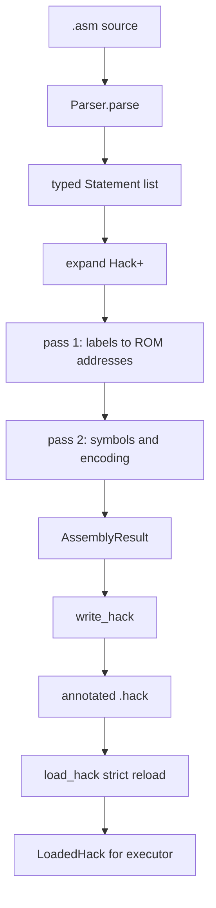

# Hack 汇编器内部原理

[← Hack ISA](/zh/hack/isa) · [Hack 概览](/zh/hack/) · [English](/hack/assembler) · [执行器与测试 →](/zh/hack/execution)

本文以 [`isa/hack/tools/assembler.py`](https://github.com/VIDLG/verylogic-workspace-sail/blob/main/isa/hack/tools/assembler.py) 为主线，解释一个小型但完整的汇编器怎样把 `.asm` 源码变成 16 位 Hack 机器码。它不是 Python API 逐函数抄录，而是一次“编译器阶段为什么要这样排”的导读。

## 汇编器负责什么

输入同时包含三类信息：

```asm
.description Example program
SET R0, 6             // Hack+ 伪指令
(LOOP)                // 汇编符号
@R0                   // 标准 A 指令
D=M                   // 标准 C 指令
.assert R0 == 6       // 执行元数据
.max_steps 1000
```

解析后的源码有三个去向：

1. `records`：真正进入 ROM 的 `MachineWord`；
2. 执行 `metadata`：HALT 地址、断言、步数限制和 Hook 路径；
3. 仅属于源码的 `.description`：供 workflow 使用，在构造 `AssemblyResult` 前丢弃。

这种分离既保证 `.assert` 等测试能力不会伪装成 Hack 指令，也让程序发现说明保持在可执行 `.hack` 契约之外。



## 为什么手写解析器就够了

Hack 汇编是按行组织的简单语言：没有嵌套表达式、运算符优先级或跨行语法。这里不需要引入 parser generator；正则表达式负责识别一行的形状，Python dataclass 负责形成类型化中间表示。

“简单”不等于“宽松”。解析器会拒绝：

- 非法标签与符号；
- 不存在的 `comp`、`dest`、`jump`；
- 重复 `.description`、`.hook` 或 `.max_steps`；
- 未知点指令；
- 越界 A 指令、RAM 地址和断言值；
- 绝对、越界或非 `.sail` Hook 路径。

对教学汇编器而言，明确拒绝错误比猜测用户意图更重要。

## 第一阶段：保留源码身份

每个有效源码行先绑定一个 `SourceLine`：

```python
@dataclass(frozen=True)
class SourceLine:
    line: int
    text: str
```

它同时保存行号和原始文本。后续即使一条伪指令展开成四条机器指令，四个结果仍指回同一 `SourceLine`。因此生成文件可以显示：

```text
ROM[0000] L1 [1/4] SET R0, 6 => @6
ROM[0001] L1 [2/4] SET R0, 6 => D=A
```

这是一个很实用的编译器设计原则：**源码位置应当属于中间表示，而不是等到报错或打印时再猜**。

## 第二阶段：类型化语句

`Parser.parse()` 不直接生成整数，而是生成 `Statement` 联合类型：

| 中间节点 | 表示什么 | 是否进入 ROM |
| --- | --- | --- |
| `AInstruction` | `@value` 或 `@symbol` | 是 |
| `CInstruction` | `dest=comp;jump` | 是 |
| `Label` | `(NAME)` | 否 |
| `PseudoInstruction` | Hack+ 写法 | 展开后进入 |
| `AssertionDirective` | `.assert` | 否，进入 metadata |
| `MaxStepsDirective` | `.max_steps` | 否，进入 metadata |
| `HookDirective` | `.hook` | 否，进入执行 metadata |
| `DescriptionDirective` | `.description` | 否，仅供源码发现 |

解析优先级是有意安排的：

1. 去掉 `//` 后的注释和首尾空白；
2. 识别 `.description`、`.assert`、`.max_steps`、`.hook`；
3. 识别标签；
4. 识别以 `@` 开头的 A 指令；
5. 根据首个单词识别 Hack+；
6. 剩余内容按 C 指令解析。

点指令必须先于普通指令，否则 `.assert` 或 `.description` 可能得到含糊的“非法 C 指令”错误。以 `@` 开头的内容单独处理，则能把“非法操作数”和“根本不是 A 指令”区分开。

`source_description(text)` 从同一组类型化语句中寻找 `DescriptionDirective`。`expand()` 会丢弃这个节点，而不是把它放入执行 metadata。因此 workflow 能从源码列出程序，而 `.description` 不会序列化到 `.hack` metadata。

### A 指令验证

A 操作数只能是：

- `0..32767` 的十进制数；
- 匹配 `[A-Za-z_.$:][A-Za-z0-9_.$:]*` 的 Hack 符号。

解析阶段保留符号字符串，因为此时还不知道标签地址，也不应提前分配变量。

### C 指令规范化

解析器允许字段周围出现空白，然后规范化：

```asm
AD = D + 1 ; JGT
```

得到：

```python
CInstruction(dest="AD", comp="D+1", jump="JGT")
```

接着通过 `COMP`、`DEST`、`JUMP` 表验证。这里的表既是编码表，也是语言允许列表；未知组合不会进入后续阶段。

## 第三阶段：Hack+ 降级

`expand()` 遍历 `Statement`：

- 指令和标签进入待汇编代码；
- 点指令收集到独立 metadata；
- `PseudoInstruction` 变成标准 A/C 指令。

例如：

```asm
JEQ R1, DONE
```

展开为：

```asm
@R1
D=M
@DONE
D;JEQ
```

每条展开指令都携带 `PseudoExpansion(instruction, index, count)`，而 `source` 仍指向原始 `JEQ` 行。因此四个结果既保留正式指令写法，也保留 `[1/4]` 到 `[4/4]` 的展开位置。

### 为什么必须先展开再计算标签

假设：

```asm
SET R0, 6
(AFTER)
@AFTER
0;JMP
```

`SET` 占四个 ROM 机器字，因此 `AFTER=4`。如果第一遍先按源码行计算标签，再展开 `SET`，标签会错误地指向 `1`。

正确顺序只能是：

```text
解析 → 展开 → 标签遍历 → 最终编码
```

`HALT` 也在这里生成唯一私有标签：

```asm
(__HACKPLUS_HALT_0)
@__HACKPLUS_HALT_0
0;JMP
```

私有标签地址同时被收集到 `halt_addresses`，供 executor 判断完成。

完整 Hack+ 展开表见 [ISA 文档](/zh/hack/isa#hack-如何降级为正式指令)。

## 第四阶段：两遍汇编

### 第一遍：构造 ROM 符号表

`assemble_text()` 从预定义符号表开始：

```text
R0..R15
SP LCL ARG THIS THAT
SCREEN KBD
```

然后遍历展开后的代码：

- `Label` 记录当前 ROM 地址；
- A/C 指令追加到指令列表，并使 ROM 地址加一；
- 标签自身不占机器字；
- 重复标签和超过 32768 字的程序立即失败。

第一遍结束后，每个跳转标签都已有确定地址。

### 第二遍：解析 A 符号并编码

第二遍只遍历真实 A/C 指令。

对于 A 指令：

1. 十进制操作数直接使用；
2. 已知符号查表；
3. 未知符号被视为变量，从 RAM 地址 `16` 起顺序分配；
4. 数值以 15 位写入机器字，最高位为 `0`。

同一个变量名再次出现时复用第一次分配的地址。

对于 C 指令，编码公式是：

```text
111 + COMP[comp] + DEST[dest] + JUMP[jump]
```

例如 `D=M+1;JGT`：

```text
comp=M+1  -> 1110111
dest=D    -> 010
jump=JGT  -> 001
word       = 1111110111010001
```

每个结果封装为：

```python
MachineWord(value, source, expansion)
```

普通 A/C 指令的 `expansion` 为 `None`；Hack+ 产物则保存含正式指令和 `[i/n]` 位置的 `PseudoExpansion`。因此机器码、原始源码和伪指令展开关系始终绑在一起。

## metadata 是旁路，不是指令

`AssemblyMetadata` 包含：

```python
halt_addresses: tuple[int, ...]
assertions: tuple[Assertion, ...]
max_steps: int | None
hook_path: str
```

点指令不增加 ROM 地址。如果删除所有 `.assert`，标准机器字应完全不变；测试套件专门固定了这条性质。

### 断言在汇编阶段做什么

汇编器只负责：

- 解析目标、比较符和数值；
- 决定 `bits`、`signed`、`unsigned` 模式；
- 检查范围并规范化表示；
- 保存源码行号。

它不读取最终寄存器，也不在 Python 中执行断言。真正的断言表达式由 executor 写入生成的 Sail driver。

这种职责分离很重要：Python 负责翻译，Sail 运行程序并判断架构状态。

## `write_hack()`：把结果变成可审计产物

输出文件包含两种记录。

### 结构化 metadata

```text
//%hack format {"version":3}
//%hack hook {"path":"hooks.sail"}
//%hack halt {"address":12}
//%hack assert {"line":20,"mode":"bits","operator":"==","target":"R2","value":42}
//%hack max_steps {"value":1000}
```

这些记录放在机器字之前，使用固定 JSON 键集合和版本号。

### 带源码映射的机器字

```text
0000000000000110 // ROM[0000] L1 [1/4] SET R0, 6 => @6
1110110000010000 // ROM[0001] L1 [2/4] SET R0, 6 => D=A
```

行首仍是普通 Hack 16 位二进制。不了解 metadata 的简单工具可以忽略注释；项目 executor 则能恢复完整运行契约。

### 教学信息级别

可选的 `comments` 参数控制机器字后的解释性注释，不改变机器字和结构化 metadata：

| 级别 | 机器字注释 |
| --- | --- |
| `none` | 不添加行尾解释 |
| `summary` | ROM 地址和源码行；Hack+ 机器字还显示 `[i/n] 源伪指令 => 正式指令` |
| `full` | summary 信息加完整原始源码文本 |

默认使用 `summary`：伪指令展开仍然可见，普通 A/C 指令则保持紧凑。`//%hack` 是机器可读的执行 metadata，因此所有级别都会保留。先运行 `pixi run just hack assemble multiply`；需要完整源码文本和 driver 解释时再显式选择 `full`。

## 为什么还要 `load_hack()`

executor 不直接使用内存中的 `AssemblyResult`。它先调用 `write_hack()`，再通过 `load_hack()` 重新读取文件。

这建立了一条清晰边界：

```text
汇编器内部状态 --写出--> .hack 产物 --严格加载--> executor 输入
```

如果不重新加载，writer 忘记保存某项 metadata 时，运行仍可能从内存对象中“碰巧成功”，磁盘产物却不完整。重新加载迫使执行只依赖真正交付的文件。

### loader 的严格规则

`load_hack()` 会检查：

- 每个机器字恰好 16 位且只含 `0/1`；
- metadata 必须出现在机器字之前；
- 非 `format` metadata 之前必须有唯一的 `format version=3`；
- JSON 不允许重复键、遗漏键或额外键；
- Hook 路径必须是规范化的包内相对 `.sail` 路径；
- HALT、断言和步数值必须类型正确且范围合法；
- 记录的 HALT 地址必须真的指向 `@address; 0;JMP` 自循环；
- ROM 不能超过 32768 个机器字。

普通、不带 metadata 的 `.hack` 仍然可以加载；它会使用默认 Hook，且没有断言和 HALT 地址。

## 错误设计

源码错误统一使用 `AssemblyError(line, message)`，CLI 最终通过 `argparse` 报告。行号来自最早保存的 `SourceLine`，因此伪指令展开后出现的问题仍指向用户写的那一行。

产物加载错误使用带文件路径和文件行号的 `ValueError`。这是不同的错误域：

- `AssemblyError`：源程序不合法；
- `ValueError` from `load_hack`：中间产物损坏或不可信。

不要把二者合并成模糊的“汇编失败”，否则调试时无法判断问题发生在哪个边界。

## 函数调用地图

```text
CLI main
└── assemble(source)
    └── assemble_text(text)
        ├── parse(text)
        │   └── Parser.parse
        ├── expand(statements)
        ├── pass 1: labels
        └── pass 2: symbols + encode
└── write_hack(result, output)

executor
└── load_hack(output)
    └── LoadedHack(words, metadata)
```

关键函数阅读顺序：

1. `Parser.parse`
2. `Parser._parse_instruction`
3. `expand`
4. `assemble_text`
5. `write_hack`
6. `load_hack`

## 测试怎样覆盖汇编器

[`test_assembler.py`](https://github.com/VIDLG/verylogic-workspace-sail/blob/main/isa/hack/tests/test_assembler.py) 不是只测几个示例程序，它固定了每个阶段的契约：

| 测试方向 | 防止什么回归 |
| --- | --- |
| 合法/非法符号 | 把错误标签静默当成变量 |
| 伪指令源码映射 | 展开后丢失原始行号和文本 |
| `.hack` round trip | writer 与 loader 语义漂移 |
| 点指令不发射机器字 | 测试功能改变正式程序 |
| 断言模式和范围 | 有符号/无符号解释错误 |
| metadata 严格校验 | 损坏文件被宽松接受 |
| 官方 `comp/dest/jump` 参数化测试 | 编码表偏离 nand2tetris 规范 |

`programs/*.asm` 的集成运行则验证“解析和编码出的程序确实能在 Sail ISA 上得到预期状态”。

## 建议练习

### 练习一：手算一次两遍汇编

对下面源码列出展开后的 ROM 地址、符号表和机器字：

```asm
SET sum, 1
(LOOP)
INC sum
GOTO LOOP
```

特别注意变量 `sum` 从 `16` 分配，而 `LOOP` 使用展开后的 ROM 地址。

### 练习二：增加一个伪指令

先写出它的标准 Hack 展开，再思考：

- 会覆盖哪些寄存器？
- 展开必须发生在哪个阶段？
- 是否需要私有标签？
- 怎样保留 `SourceLine`？
- 单元测试要固定机器字、源码映射还是 metadata？

只有这些问题都有明确答案后，才适合修改 `PSEUDO_NAMES`、解析模式和 `expand()`。

### 练习三：观察 round trip

```sh
pixi run just hack assemble multiply
```

打开 `isa/hack/.build/multiply.hack`，然后对照：

- 源码中的每一条伪指令；
- 展开的标准指令；
- ROM 地址；
- 16 位机器码；
- 文件顶部 metadata。

下一步阅读 [执行器与测试工作流](/zh/hack/execution)，继续追踪这个 `.hack` 文件怎样变成真正运行的程序。
