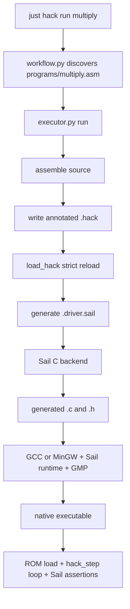
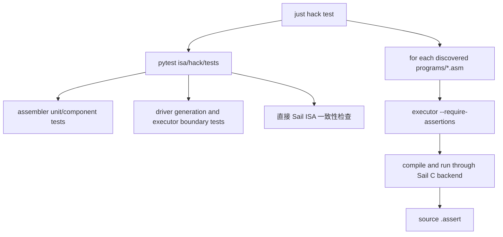

# Hack 执行器与测试工作流

[← 汇编器内部原理](/zh/hack/assembler) · [公共教学契约](/zh/reference/teaching-contract) · [English](/hack/execution)

本文沿着 [`executor.py`](https://github.com/VIDLG/verylogic-workspace-sail/blob/main/isa/hack/tools/executor.py) 和 [`workflow.py`](https://github.com/VIDLG/verylogic-workspace-sail/blob/main/isa/hack/tools/workflow.py) 的调用链，解释 Hack 机器码怎样通过 Sail C 后端变成宿主机可执行程序，以及单元测试、ISA 一致性测试和汇编程序集成测试怎样组成闭环。

## 三个文件的职责边界

| 文件 | 负责什么 | 不负责什么 |
| --- | --- | --- |
| `model/core.sail`、profile 入口文件/project | 共享 instruction/exception、ALU/state/fetch/decode/encode/execute/step，以及 profile 位宽、合法性与 mapping clauses | 加载特定程序映像、特定程序的 `main()`、测试程序发现 |
| `artifact.py` | 序列化 runtime override、创建文件开头的 manifest block、原子写 `.hack`、严格加载与 Hack-specific manifest/completion 校验 | 指令解析、driver 策略或模型语义 |
| `executor.py` | Staged driver generation、加载原始 ROM、运行控制、Sail/C 编译、断言、执行与 closure 发布 | A/C 解码、程序发现和批量测试策略 |
| `workflow.py` | 发现源码、选择程序、组织 `check/assemble/run/test/clean` | ISA 语义和机器状态判断 |

这种拆分让共享语义保持可复用，同时由每个 `projects/<profile>.sail_project` 固定一份完整 ISA 模型。换一个 Hack 程序只需要生成新的 ROM 加载器和 driver，不需要改取指、解码或 CPU 语义。



## 为什么 profile project 没有 `main()`

ISA 模型拥有架构 ROM，并回答“一步执行怎样取出原始机器字、解码并改变架构状态”，但一个可运行程序还需要回答：

- 要把哪些原始机器字加载进 ROM？
- 什么时候算执行完成？
- 最终检查哪些断言？
- 打印哪些状态？

这些程序专属问题不应硬编码在 ISA 中。`executor.write_driver()` 为每个 `.hack` 产物生成一个小型 Sail `main()`；它把程序映像加载到模型自有的 `ROM`，再围绕 `hack_step()` 提供运行控制。

这和真实系统中的分层很相似：CPU 模型定义存储、取指、解码和指令行为，加载器或仿真器提供程序映像与运行控制策略。

## `executor.run()` 的完整顺序

```text
1. 校验 CLI 参数
2. assemble(program) 得到 AssemblyResult
3. 按 CLI > source > default 解析有效 `max_steps`
4. 检查断言要求与 ROM 大小
5. 在最终产物文件旁创建临时 staging 子目录
6. write_hack() 写入 staged <output>.hack
7. load_hack() 从磁盘严格重新加载
8. 从 LoadedHack 生成 staged <output>.driver.sail
9. Sail 生成 staged C/header
10. C 编译器把 staged native executable 与 Sail runtime/GMP 链接
11. 运行 staged executable 及其中的 Sail assertions
12. 把完整 staged closure 发布到最终路径
```

第 6、7 步形成持久化信任边界：有效 CLI override 会在 driver generation 前序列化进 `.hack`。第 12 步形成发布边界：只有 staged execution 成功才更新最终名称。详见[为什么要重新加载](/zh/hack/assembler#为什么还要-load_hack)和[公共发布契约](/zh/reference/teaching-contract#staging-与发布)。

### 哪些配置属于哪个入口

| 关注点 | 源码 | CLI | 原因 |
| --- | --- | --- | --- |
| 步数预算 | `.max_steps` | `--max-steps` | 单次运行可变策略 |
| 程序说明 | `.description` | 无 | Discovery identity 与 manifest 内容 |
| 状态检查 | `.assert` | 无 | 源码拥有的回归契约 |
| Artifact 注释 | 无 | `--comments` | 仅宿主展示策略 |
| 输出 prefix | 无 | `--output` | 宿主文件系统策略 |
| 强制断言存在 | 无 | `--require-assertions` | workflow/测试门禁 |

所以 CLI 覆盖是有意分类，而不是机械复制：只有运行配置使用 `CLI > source > default`；CLI 不能静默替换源码断言或程序说明。

## 构建产物

默认 `hack16` 的 `multiply` 单程序输出 prefix 如下；`--profile hack32` 会把 profile 目录替换为 `hack32`，`asm` 表示直接汇编 frontend：

```text
isa/hack/.build/hack16/asm/multiply/multiply
```

executor 可能生成：

| 产物 | 来源 | 作用 |
| --- | --- | --- |
| `multiply.hack` | `write_hack()` | 机器字和运行 metadata 的稳定边界 |
| `multiply.driver.sail` | `write_driver()` | 程序专属 ROM 加载行、运行控制、断言和输出 |
| `multiply.driver.sail_project` | `write_driver_project()` | 把生成的 driver 连接到所选固定 profile project |
| `multiply.c` | Sail C 后端 | ISA + driver 的 C 实现 |
| `multiply.h` | Sail C 后端 | 生成 C 的声明 |
| `multiply.exe`（Windows）或 `multiply`（Linux） | C 编译器 | 最终宿主机程序 |

完整 `run` 会在 `.build/<profile>/asm/<program>/` 内、最终产物文件旁的临时 staging 子目录中创建、编译并执行这些文件，只有 execution/assertions 成功才发布整个单程序 closure。Backup-and-replace 发布在安装失败时恢复先前目标；staged build 或 run 失败会保留先前已发布 closure。

## `LoadedHack` 是 executor 的真正输入

重新加载后的对象只有：

```python
@dataclass(frozen=True)
class LoadedHack:
    profile: Profile
    words: list[int]
    metadata: AssemblyMetadata
    word_comments: tuple[str | None, ...]
    manifest: HackManifest
```

这里没有解析器 AST、符号表或 Python 端隐藏状态。driver 的所有程序行为只能来自：

- `.hack` 中的机器字；
- `.hack` 顶部结构化 metadata；
- 从 `.hack` 重新加载的可选逐机器字教学注释；
- 所选 profile project 的语义。

这里的 loader 专指宿主侧 Python artifact loader `isa/hack/tools/artifact.py::load_hack()`，不是 generated `load_program()`，也不是 Sail 模型里的 `fetch_hack()`。Artifact loader 与 driver 对各 manifest 字段的消费方式并不相同：

| Manifest 数据 | 消费者与作用 |
| --- | --- |
| `completion` | `artifact.py` 校验 `lowered-self-loop`、word addressing、地址排序/范围，以及实际的 `@address; 0;JMP` 机器字。地址随后成为 `AssemblyMetadata.halt_addresses`，`executor.py` 据此生成 `lowered_halt_n` 常量和 completion 检查。 |
| `runtime.max-steps` | 重载为 `AssemblyMetadata.max_steps`；`executor.py` 据此生成 `driver_max_steps`。 |
| `assertions` | 规范化并重载为 `AssemblyMetadata.assertions`；`executor.py` 据此生成 Sail assertions。 |
| `comments` | 约束严格的逐机器字注释布局，并且必须与请求的 driver 展示档位一致。 |
| `isa`、`profile`、`isa-metadata` | `load_hack()` 要求 `isa=hack`，`profile` 为 `hack16` 或 `hack32`，并按所选模型校验常量、拒绝篡改或不一致；`standard` 从来不是合法 profile。`loaded_rom_words` 来自实际重载字数，架构位宽和容量属于所选 project。 |
| `source`、`description` | 用于 identity 和人类可读 preamble，不参与执行语义。 |
| `provenance` | Hack 直接汇编没有额外 frontend 转换链，因此省略。 |

## driver 怎样加载模型自有的 ROM

所选 profile composition 拥有完整架构指令存储，并复用共享原始取指操作：

```ocaml
register ROM : vector(32768, word)

function fetch_hack(pc : program_counter) -> word =
  ROM[unsigned(pc)]
```

`fetch_hack(pc)` 返回 profile 宽度的原始 `word`——`hack16` 为 16 位，`hack32` 为 32 位——不负责解码。模型的 `hack_step()` 组合完整架构路径：

```text
fetch_hack(PC) -> decode_hack(word) -> execute(decoded instruction) -> unit
                              非法机器字 -> throw HackIllegalInstruction(word)
```

`write_driver()` 不再生成 `instruction_at`、`execute_at` 或地址到解码结果的 `match`，而是生成包含原始赋值的 `load_program()`：

```ocaml
function load_program() -> unit = {
  ROM[0] = 0b0000000000000110; // ROM[0000] L4 [1/4] SET R0, 6 => @6
  ROM[1] = 0b1110110000010000; // ROM[0001] L4 [2/4] SET R0, 6 => D=A
  // ...
}
```

示例加载行是默认 `hack16` 形式；`hack32` 行使用 32 位 literal。Python 只重新加载机器字并写出这些 ROM 加载行，从不解码 A 指令或 C 指令；合法性检查、解码和执行都留在 Sail 中。合法 `hack_step()` 返回 `unit`；非法编码会在执行开始前抛出 `HackIllegalInstruction(word)`。生成的 driver 直接调用 `hack_step()`，未预期的 exception 会使运行失败。

`.hack` 和 driver 共用 `none / summary / full` 级别。默认的 `summary` 会在每个 `ROM[index] = word` 加载行旁显示规范化汇编源码，Hack+ 机器字还带有 `[i/n] 源伪指令 => 正式指令`，行内汇编注释放在最右侧。`full` 增加精确的原始源码文本，并扩展断言来源与最终输出解释。这些内容来自 `LoadedHack.word_comments`，说明注释确实穿过了磁盘文件边界。

`load_program()` 只写入已加载映像。生成的 `main()` 会在每次尝试前调用 `execution_should_continue(PC, steps)`，避免在程序已加载 ROM 范围之外调用 `hack_step()`。

## driver 怎样停止并验证完成原因

生成的 driver 把微妙的运行条件集中在一个小函数中：

```ocaml
let lowered_halt_0 : program_counter = 0b000000000110011
let driver_max_steps : int = 100000

function execution_should_continue(pc : program_counter, steps : int) -> bool = {
  (pc != lowered_halt_0)
  & unsigned(pc) < loaded_rom_words
  & steps < driver_max_steps
}
```

循环本身保持直接：

```ocaml
while execution_should_continue(PC, steps) {
  hack_step();
  steps = steps + 1
}
```

`loaded_rom_words` 由重新加载的 artifact 机器字数量生成；对 `basic_alu` 来说它是 `53`，覆盖 ROM 地址 `0..52`。它不是 `max_steps`，也不限制循环可以重复访问这些地址多少次。每个 `lowered_halt_n` 都来自重载后文件开头的 `//%` manifest block 的 `completion.addresses`；对应位型在 Hack ISA 中没有特殊含义。

以下三种情况都会使条件变为 `false`，driver 会在循环后区分：

1. `PC` 到达 `.hack` metadata 记录的 HALT 地址：有效完成；
2. `PC` 离开已加载 ROM 映像：显式执行错误；
3. `steps` 到达 `driver_max_steps`：只有显式请求 bounded snapshot 时有效，否则是 watchdog 失败。

### 为什么 HALT 自循环不会真的执行

Hack+ `HALT` 展开为：

```asm
(HALT_PRIVATE)
@HALT_PRIVATE
0;JMP
```

metadata 记录私有标签地址。driver 在循环开始处发现 `PC` 已等于该地址，于是退出；这两条自循环机器字保留在 `.hack` 中，因此产物对所选 profile 仍合法，并会在匹配该 profile 的实现上停留于自循环。

这有意属于 driver 策略。两个 profile 都没有编码后的 HALT 指令：Hack+ `HALT` 是汇编便利写法，ROM 末尾来自已加载 artifact，两者都不是所选 project 返回的架构 outcome。若未来某个 profile 真正增加 HALT opcode，解码并返回该结果才应进入模型。

### 32768 字 ROM 特例

`PC` 只有 15 位，最大值是 `32767`。如果映像恰好装满 32768 个字，条件 `PC >= loaded_rom_words` 永远不可能成立，因为不存在可表示的“ROM 末尾之后”地址。已记录的 `HALT` 可以让程序正常完成；否则显式或默认步数预算仍会限制宿主运行，并以 watchdog 失败结束，除非源码显式请求 bounded snapshot。

## 生成的运行循环

生成的 `main()` 先加载原始机器字，在 completion 与 watchdog 控制下执行模型步骤，最后求值源码断言：

```ocaml
load_program();
var steps : int = 0;
while execution_should_continue(PC, steps) {
  hack_step();
  steps = steps + 1
};
assert (unsigned(PC) < loaded_rom_words,
        "program counter left the loaded ROM image");
// 源码断言
```

Driver 负责 completion 检查、watchdog、源码断言和最终输出。取指、解码、执行和非法机器字拒绝仍集中在模型自有的 `hack_step()`；生成的 `main()` 只提供运行控制策略。

## `max_steps` 的两种语义

有效步数上限按以下优先级决定：

```text
CLI --max-steps > source .max_steps > 默认 watchdog（100000）
```

CLI 值会在严格 reload 前替换生成 `.hack` metadata 中的源码 `.max_steps`。generator 随后从重载 metadata 生成 `driver_max_steps`；普通运行没有显式配置时则使用默认值。`execution_should_continue` 要求 `steps < driver_max_steps`，因此即使程序永久循环且没有到达 lowered HALT metadata，宿主运行也一定有界。

### 看门狗模式

如果程序有 HALT，达到上限时 `PC` 必须已经到达某个生成的 `lowered_halt_n`：

```ocaml
assert ((PC == lowered_halt_0),
        "maximum step limit reached before lowered HALT")
```

如果程序没有 HALT，也没有显式请求 bounded snapshot，预算耗尽会触发 `maximum step limit reached without lowered HALT or an explicit bounded snapshot`。两种情况表达的都是：“预算只负责限制宿主无限运行，耗尽预算不代表成功完成。”

### 有意的定步快照

如果程序：

- 没有 HALT；
- 有至少一个 `.assert`；
- 显式设置源码 `.max_steps` 或 CLI `--max-steps`；

那么上限表示“运行 N 条已退役指令后观察状态”。如果执行始终位于已加载映像内且没有 fault，driver 恰好执行 N 步，然后直接检查断言，不要求到达 lowered HALT。

这种模式适合验证循环中的稳定状态，但应谨慎使用：终止程序优先写 `HALT`，让完成语义更清晰。

## 源码断言怎样变成 Sail

汇编器已把 `.assert` 规范化为 `Assertion`。executor 再生成真正的 Sail 表达式。

### 目标映射

```text
R0  -> RAM[0]
R15 -> RAM[15]
A   -> A
D   -> D
PC  -> PC
RAM[100] -> RAM[100]
```

### 比较模式

| 源码 | 生成语义 |
| --- | --- |
| `R0 == -1` | `RAM[0] == 0xFFFF`，位精确 |
| `R0 != 0` | `RAM[0] != 0x0000`，位精确 |
| `signed(R0) < -1` | `signed(RAM[0]) < -1` |
| `unsigned(R0) > 32768` | `unsigned(RAM[0]) > 32768` |
| `unsigned(PC) >= 10` | `unsigned(PC) >= 10` |

相等/不等始终比较架构位型，并拒绝任何 `signed(...)` 或 `unsigned(...)` wrapper；ordered operator 则必须显式使用其中一种 wrapper。公共 parser 先固定这条区别，Hack 再校验 `A`、`D`、`PC`、`R0..R15` 或 `RAM[index]`。

断言错误消息保留原始源码行号，例如：

```text
assertion signed(R0) < -1 from source line 23 failed
```

这使运行期失败能够回到 `.asm`，而不是只指向生成的 driver。

## Sail 到本机程序的编译链

`compile_and_run()` 分三步。

### 1. 确保项目本地 Sail

```python
sail = install_sail.ensure_installed()
```

它选择并校验 `.pixi/sail/` 中固定版本的官方二进制，不回退到任意系统 Sail。

### 2. Sail 生成 C

概念上，executor 把所选 `isa/hack/projects/<profile>.sail_project` 源码闭包与 `<output-prefix>.driver.sail` 一起交给 Sail。Sail 对该 profile 与 driver 整体做类型检查，再生成 `<output>.c` 与 `<output>.h`。

### 3. C 编译、链接并运行

平台编译器：

- Windows：`x86_64-w64-mingw32-gcc`；
- Linux：`gcc`。

链接输入包括：

- Sail 生成的 C；
- Sail runtime 的 `rts`、`elf`、`sail`、`sail_config`、`sail_failure`、`cJSON`；
- `support/sail_windows_compat.c` 和兼容头；
- GMP（`-lgmp`）。

Pixi/Conda 前缀用于定位 GMP 头文件和库。编译成功后，executor 立即启动生成的可执行文件；任何子进程非零退出都会通过 `check=True` 传播为失败。

## 最终 `main()` 输出什么

运行结束且断言通过后，driver：

1. 有断言时打印 `ASSERT PASS`，否则打印 `RUN COMPLETE`；
2. 打印 `A`、`D`、`PC`；
3. 打印 `R0..R7`。

这些寄存器输出是方便人工观察的摘要，不是测试判定本身。回归是否通过由 Sail `assert` 和进程退出码决定，workflow 不解析打印文本来猜结果。

## `workflow.py`：控制平面

workflow 解决“仓库里有哪些示例，命令应该对哪个文件运行”，而不是执行 ISA。

### 基于源码的程序发现

`discover_programs()` 直接扫描以下程序源码：

```text
isa/hack/programs/*.asm
```

文件按名称排序，文件 stem 就是命令中的程序名。例如 `multiply.asm` 对应 `just hack run multiply`。

每个内置源码必须且只能包含一条非空 description directive：

```asm
.description Repeated-addition multiplication: 6 times 7
```

Assembler parser 校验 `.description`，`source_description()` 把它提供给 workflow discovery，`assemble_text()` 则存入 `AssemblyMetadata`。`artifact.py` 把同一文本序列化为 manifest `description`；它不产生机器字。

`discover_programs()` 还确认每个文件解析后仍位于 Hack 包内并真实存在。直接使用 `glob("*.asm")` 会有意忽略子目录和非汇编文件。

### action 分派

| action | workflow 行为 |
| --- | --- |
| `list` | 发现并打印全部直接 `programs/*.asm` 源码 |
| `check` | 检查两个 profile project；`--profile hack32` 可缩窄到一个 |
| `assemble NAME` | 为所选 profile（默认 `hack16`）原子写 `.build/<profile>/asm/NAME/NAME.hack` |
| `run NAME` | 为所选 profile 完成汇编、生成、编译和运行 |
| `test` | 对两个 profile 运行 Python/tooling、直接 Sail 与 discovered-program matrix |
| `clean` | 重建 profile-aware `.build/` 结构 |

`isa/hack/justfile` 直接把这些 action 暴露为 `just hack ...` 命令。根 `test` 与 `clean-all` 负责聚合各模块命令。

## `just hack test` 到底测试什么

`pixi run just hack check` 检查两个 project；`pixi run just hack check --profile hack32` 是窄门禁。完整 `test` 命令始终运行两个 profile。



### 第一层：汇编器测试

`test_assembler.py` 验证解析、降级、编码、metadata round trip 和坏输入拒绝。它运行很快，不需要为每个断言生成本机程序。

### 第二层：executor 组件测试

`test_executor.py` 直接调用 `write_driver()` 并检查生成源码，固定：

- 原始 `ROM[index] = word` 加载；
- 检查后的 `hack_step()` 分派和已加载映像越界失败；
- 有界循环语义；
- 位精确/有符号/无符号断言；
- 重载 metadata 是真实数据源。

部分测试通过 monkeypatch 隔离实际 C 编译，专注 Python 边界逻辑。

### 第三层：已发现程序的端到端测试

workflow 对每个已发现程序调用：

```text
executor.py ... --require-assertions
```

没有 `.assert` 的示例会直接失败，避免内置源码出现“只运行、什么也没验证”的假测试。

### 第四层：直接 Sail ISA 一致性测试

`tests/sail/hack16/conformance.sail` 与 `tests/sail/hack32/conformance.sail` 直接检查 profile known word/合法性，以及共享 `alu()`、跳转、destination、旧 `A`、PC 回绕和 fault 不提交。这一层独立验证 Sail ISA 函数，不依赖 generated-driver 集成路径。

### 全仓库测试

根命令：

```sh
pixi run just test
```

先运行 `tests/test_install_sail.py` 等全局工具测试，再调用 `just hack test`。未来增加 ISA 时，根层只负责聚合各模块，不应知道 Hack executor 的内部细节。

## 如何调试一次失败运行

按产物边界从前向后排查：

1. **源码错误**：查看 assembler 的 `line N` 报错；
2. **编码错误**：运行 `just hack assemble NAME`，检查 `.hack` 机器字旁的源码注释；
3. **metadata 错误**：检查 `.hack` 文件开头的 `//%` manifest block；
4. **driver 错误**：打开 `.driver.sail`，查看 `load_program()` ROM 加载行、检查单步结果的运行控制和断言；
5. **Sail 类型错误**：直接观察 Sail `-c` 输出；
6. **C 编译错误**：检查编译器、runtime include、GMP 与平台兼容层；
7. **架构断言失败**：根据错误中的 `.asm` 行号和最终寄存器摘要定位；
8. **批量工作流错误**：先直接运行单个 `just hack run NAME`，再检查源码发现或批量编排。

不要一开始就在 `workflow.py` 加打印。它通常只是把下层错误传播上来；真正证据更可能在 `.hack`、`.driver.sail` 或生成 C 的边界。

## 函数阅读顺序

### executor

1. `run`
2. `write_driver`
3. `_assertion_expression`
4. `compile_and_run`
5. `main`

### workflow

1. `discover_programs`
2. `selected_program` / `source_path`
3. `assemble` / `run`
4. `test`
5. `main`

## 建议练习

### 练习一：读生成的 driver

```sh
pixi run just hack run multiply
```

打开 `isa/hack/.build/hack16/asm/multiply/multiply.driver.sail`（或对应 `.build/hack32/asm/multiply/` artifact），找到：

- `ROM[0] = word` 加载行；
- HALT 地址；
- 生成的运行循环和检查 `hack_step()` 结果的调用；
- `R2 == 42` 对应的 Sail 断言；

### 练习二：写一个定步程序

写一个没有 `HALT` 的自循环，加 `.max_steps 10` 和最终 `.assert`。预测 driver 会生成什么循环和断言，再打开实际 `.driver.sail` 对照。

### 练习三：区分测试层

故意分别引入：

1. 非法汇编助记符；
2. 错误 `.assert` 预期值；
3. 生成 driver 中的 Sail 类型错误；
4. 某个内置源码缺失或重复 `.description`。

观察每个错误在哪一层被捕获。一个清晰的工具链应让错误尽可能在最靠近根因的边界失败。

---

返回 [Hack 概览](/zh/hack/)，或打开 [Hack 包参考手册](https://github.com/VIDLG/verylogic-workspace-sail/blob/main/isa/hack/README.zh-CN.md)。
