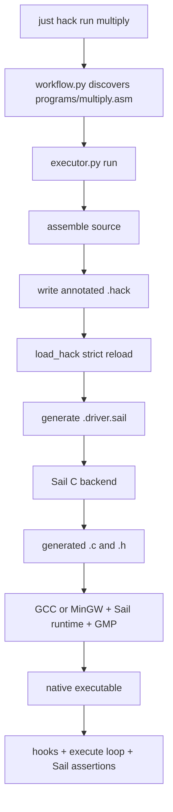
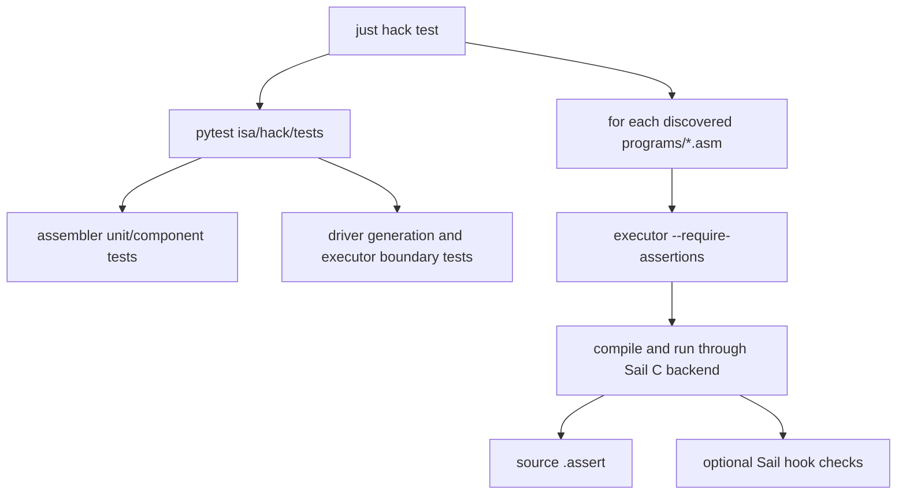

# Hack 执行器与测试工作流

[← 汇编器内部原理](/zh/hack/assembler) · [Hack 概览](/zh/hack/) · [English](/hack/execution)

本文沿着 [`executor.py`](https://github.com/VIDLG/verylogic-workspace-sail/blob/main/isa/hack/tools/executor.py) 和 [`workflow.py`](https://github.com/VIDLG/verylogic-workspace-sail/blob/main/isa/hack/tools/workflow.py) 的调用链，解释 Hack 机器码怎样通过 Sail C 后端变成宿主机可执行程序，以及单元测试、ISA 一致性测试和汇编程序集成测试怎样组成闭环。

## 三个文件的职责边界

| 文件 | 负责什么 | 不负责什么 |
| --- | --- | --- |
| `hack.sail` | A/C 指令、ALU、寄存器、RAM、PC 状态转换 | ROM 内容、特定程序的 `main()`、测试程序发现 |
| `executor.py` | 生成程序专属 driver、调用 Sail/C 编译、运行并检查断言 | 程序发现和批量测试策略 |
| `workflow.py` | 发现源码、选择程序、组织 `check/assemble/run/test/clean` | ISA 语义和机器状态判断 |

这种拆分让 `hack.sail` 保持为可复用的 ISA 模型。换一个 Hack 程序只需要生成新的 driver，不需要改 CPU 语义。



## 为什么 `hack.sail` 没有 `main()`

ISA 模型回答“一条已经解码的指令怎样改变架构状态”，但一个可运行程序还需要回答：

- ROM 的每个地址是什么机器字？
- 当前 `PC` 对应哪条指令？
- 什么时候算执行完成？
- 每步前后是否调用 Hook？
- 最终检查哪些断言？
- 打印哪些状态？

这些问题随程序变化，不应硬编码在 ISA 中。`executor.write_driver()` 为每个 `.hack` 产物生成一个小型 Sail 主程序来补齐它们。

这和真实系统中的分层很相似：CPU 核心定义指令行为，加载器或仿真器提供程序映像与运行控制。

## `executor.run()` 的完整顺序

```text
1. 校验 CLI 参数
2. assemble(program) 得到 AssemblyResult
3. 计算 CLI/source 的有效 max_steps
4. 检查断言要求和 32768 字 ROM 特例
5. 删除同名前次构建产物
6. write_hack() 写入 <output>.hack
7. load_hack() 从磁盘严格重新加载
8. write_driver() 生成 <output>.driver.sail
9. 从重载 metadata 安全解析 Hook 文件
10. Sail 生成 C
11. C 编译器链接运行时和 GMP
12. 运行宿主机可执行程序
```

最关键的设计点是第 6、7 步。executor 不把汇编阶段的内存对象直接传到 driver，而是强制经过 `.hack` 文件边界。详见 [汇编器原理：为什么要重新加载](/zh/hack/assembler#为什么还要-load_hack)。

## 构建产物

以 `multiply` 为例，输出前缀是：

```text
isa/hack/.build/multiply
```

executor 可能生成：

| 产物 | 来源 | 作用 |
| --- | --- | --- |
| `multiply.hack` | `write_hack()` | 机器字和运行 metadata 的稳定边界 |
| `multiply.driver.sail` | `write_driver()` | 程序专属 ROM、循环和断言 |
| `multiply.c` | Sail C 后端 | ISA + Hook + driver 的 C 实现 |
| `multiply.h` | Sail C 后端 | 生成 C 的声明 |
| `multiply.exe`（Windows）或 `multiply`（Linux） | C 编译器 | 最终宿主机程序 |

每次运行前会删除同名旧产物，避免编译失败后误运行历史可执行文件。Windows 上若旧文件权限阻止删除，代码会尝试通过 `icacls` 恢复当前用户权限。

## `LoadedHack` 是 executor 的真正输入

重新加载后的对象只有：

```python
@dataclass(frozen=True)
class LoadedHack:
    words: list[int]
    metadata: AssemblyMetadata
    word_comments: tuple[str | None, ...] = ()
```

这里没有解析器 AST、符号表或 Python 端隐藏状态。driver 的所有程序行为只能来自：

- `.hack` 中的机器字；
- `.hack` 顶部结构化 metadata；
- 从 `.hack` 重新加载的可选逐机器字教学注释；
- 固定的 `hack.sail`；
- metadata 选择的包内 Hook。

`test_run_uses_hook_path_from_reloaded_metadata` 专门验证 Hook 选择来自**重载结果**，而不是先前的 `AssemblyResult`。

## driver 怎样表示 ROM

`write_driver()` 把每个机器字变成 Sail `match` 分支：

```ocaml
function instruction_at(pc : program_counter) -> instruction = {
  match pc {
    0b000000000000000 => encdec(0b0000000000000110), // ROM[0000] L4 [1/4] SET R0, 6 => @6
    0b000000000000001 => encdec(0b1110110000010000), // ROM[0001] L4 [2/4] SET R0, 6 => D=A
    // ...
    _ => AInstruction(0b000000000000000)
  }
}
```

这做了两件事：

1. ROM 地址直接成为 15 位模式；
2. 16 位机器字通过 `hack.sail` 的 `encdec` 解码。

因此 executor 不在 Python 中解释 A/C 指令。Python 只生成 ROM 映射，真正的解码和执行仍由 Sail 模型完成。

`.hack` 和 driver 共用 `none / summary / full` 级别。默认的 `summary` 会给每个 ROM 分支标出地址与源码行，Hack+ 机器字还带有 `[i/n] 源伪指令 => 正式指令`。`full` 增加完整原始源码文本，并扩展断言来源、Hook 与最终输出解释。这些内容来自 `LoadedHack.word_comments`，说明注释确实穿过了磁盘文件边界。

默认分支只是让函数在类型上完备；正常执行会先由 `execution_complete()` 阻止越过已加载 ROM 的取指。

## driver 怎样判断结束

生成的函数大致为：

```ocaml
function execution_complete(pc : program_counter) -> bool = {
  match pc {
    HALT_ADDRESS_0 => true,
    HALT_ADDRESS_1 => true,
    _ => unsigned(pc) >= ROM_LENGTH
  }
}
```

执行在以下任一条件成立时完成：

1. `PC` 到达 `.hack` metadata 记录的 HALT 地址；
2. `PC` 离开已加载 ROM。

### 为什么 HALT 自循环不会真的执行

Hack+ `HALT` 展开为：

```asm
(HALT_PRIVATE)
@HALT_PRIVATE
0;JMP
```

metadata 记录私有标签地址。driver 在循环开始处发现 `PC` 已等于该地址，于是退出；这两条自循环机器字保留在 `.hack` 中，保证产物在原生 Hack 上仍是合法程序。

### 32768 字 ROM 特例

`PC` 只有 15 位，最大值是 `32767`。如果 ROM 恰好装满 32768 个字，条件 `PC >= ROM_LENGTH` 永远不可能成立。因此 executor 要求满 ROM 程序必须有：

- 已记录的 `HALT`；或
- `max_steps`。

否则程序没有可表示的“ROM 末尾之后”地址。

## 主执行循环

无限制版本的 driver 生成：

```ocaml
var steps : int = 0;
hack_hook_before_run();
while execution_complete(PC) == false {
  hack_hook_before_step(steps);
  execute(instruction_at(PC));
  steps = steps + 1;
  hack_hook_after_step(steps)
};
// assertions
hack_hook_after_run(steps);
```

时序契约是：

| 时点 | `step` 含义 |
| --- | --- |
| `before_run()` | 尚未进入循环 |
| `before_step(steps)` | 即将执行的指令编号，从 `0` 开始 |
| `execute(...)` | 调用 `hack.sail` 的 ISA 状态转换 |
| `steps = steps + 1` | 已完成指令数增加 |
| `after_step(steps)` | 参数从 `1` 开始，表示已完成数量 |
| `.assert` | 循环结束后检查核心回归契约 |
| `after_run(steps)` | 只有源码断言通过后才调用 |

[`test_hook_call_order_preserves_core_assertions`](https://github.com/VIDLG/verylogic-workspace-sail/blob/main/isa/hack/tests/test_executor.py) 通过检查生成源码中的位置顺序固定了这份契约。

## `max_steps` 的两种语义

有效步数上限按以下优先级决定：

```text
CLI --max-steps > source .max_steps > no limit
```

有上限时循环额外要求 `steps < limit`。

### 看门狗模式

如果程序有 HALT，或者没有断言来定义定步快照，那么达到上限后必须已经 `execution_complete(PC)`：

```ocaml
assert (execution_complete(PC),
        "maximum step limit reached before HALT or ROM end")
```

这表示“程序本应结束，上限只是防止无限运行”。

### 有意的定步快照

如果程序：

- 没有 HALT；
- 有至少一个 `.assert`；
- 设置了 `max_steps`；

那么上限可以表示“最多运行 N 步后观察状态”。对于在 ROM 内持续运行的程序，循环恰好执行 N 步，然后直接检查断言，不要求 `execution_complete`。

这种模式适合验证循环中的稳定状态，但应谨慎使用：终止程序优先写 `HALT`，让完成语义更清晰。

## 源码断言怎样变成 Sail

汇编器已把 `.assert` 规范化为 `Assertion`。executor 再生成真正的 Sail 表达式。

### 目标映射

```text
R0  -> RAM[0]
R15 -> RAM[15]
A   -> A
D   -> D
PC  -> PC
RAM[100] -> RAM[100]
```

### 比较模式

| 源码 | 生成语义 |
| --- | --- |
| `R0 == -1` | `RAM[0] == 0xFFFF`，位精确 |
| `R0 != 0` | `RAM[0] != 0x0000`，位精确 |
| `R0 < -1` | `signed(RAM[0]) < -1` |
| `unsigned(R0) > 32768` | `unsigned(RAM[0]) > 32768` |
| `PC >= 10` | `unsigned(PC) >= 10` |

相等/不等始终比较机器位；即使源码写了 `signed(R0) == -1`，生成表达式仍按 `0xFFFF` 位值比较。关系运算才使用 `signed()` 或 `unsigned()`。

断言错误消息保留原始源码行号，例如：

```text
assertion signed(R0) < -1 from source line 23 failed
```

这使运行期失败能够回到 `.asm`，而不是只指向生成的 driver。

## Hook 怎样被选择和约束

`.hook` 路径先由汇编器规范化并写入 `.hack`，重新加载后再由 `resolve_hook_source()` 解析。

安全规则包括：

- 必须是相对 POSIX `.sail` 路径；
- 不能包含 `..`、绝对路径或盘符；
- 文件必须存在且是普通文件；
- `resolve()` 后必须仍位于 `isa/hack` 包目录内。

最终编译的三个 Sail 输入按顺序是：

```text
hack.sail + selected hook + generated driver
```

Hook 与 ISA 和 driver 在同一生成程序中，因此能直接访问 `A`、`D`、`PC`、`RAM`。这也解释了为什么必须限制 Hook 到包内可信源码。

## Sail 到本机程序的编译链

`compile_and_run()` 分三步。

### 1. 确保项目本地 Sail

```python
sail = install_sail.ensure_installed()
```

它选择并校验 `.pixi/sail/` 中固定版本的官方二进制，不回退到任意系统 Sail。

### 2. Sail 生成 C

概念命令：

```sh
sail -c -o <output-prefix> \
  isa/hack/hack.sail \
  <selected-hook.sail> \
  <output-prefix>.driver.sail
```

Sail 对三个文件整体做类型检查，并生成 `<output>.c` 与 `<output>.h`。

### 3. C 编译、链接并运行

平台编译器：

- Windows：`x86_64-w64-mingw32-gcc`；
- Linux：`gcc`。

链接输入包括：

- Sail 生成的 C；
- Sail runtime 的 `rts`、`elf`、`sail`、`sail_config`、`sail_failure`、`cJSON`；
- `support/sail_windows_compat.c` 和兼容头；
- GMP（`-lgmp`）。

Pixi/Conda 前缀用于定位 GMP 头文件和库。编译成功后，executor 立即启动生成的可执行文件；任何子进程非零退出都会通过 `check=True` 传播为失败。

## 最终 `main()` 输出什么

运行结束且断言通过后，driver：

1. 调用 `hack_hook_after_run(steps)`；
2. 有断言时打印 `ASSERT PASS`，否则打印 `RUN COMPLETE`；
3. 打印 `A`、`D`、`PC`；
4. 打印 `R0..R7`。

这些寄存器输出是方便人工观察的摘要，不是测试判定本身。回归是否通过由 Sail `assert` 和进程退出码决定，workflow 不解析打印文本来猜结果。

## `workflow.py`：控制平面

workflow 解决“仓库里有哪些示例，命令应该对哪个文件运行”，而不是执行 ISA。

### 基于源码的程序发现

`discover_programs()` 直接扫描以下程序源码：

```text
isa/hack/programs/*.asm
```

文件按名称排序，文件 stem 就是命令中的程序名。例如 `multiply.asm` 对应 `just hack run multiply`。

每个内置源码必须且只能包含一条非空、仅供源码发现使用的指令：

```asm
.description Repeated-addition multiplication: 6 times 7
```

assembler parser 负责校验 `.description`，但 `expand()` 会在构造机器码和执行 metadata 前丢弃它；workflow 通过 `source_description()` 获取说明。因此发现信息与程序放在一起，而 `.description` 不会序列化到 `.hack` metadata。

`discover_programs()` 还确认每个文件解析后仍位于 Hack 包内并真实存在。直接使用 `glob("*.asm")` 会有意忽略子目录和非汇编文件。

### action 分派

| action | workflow 行为 |
| --- | --- |
| `list` | 发现并打印全部直接 `programs/*.asm` 源码 |
| `check` | 确保 Sail 已安装，执行 `sail --just-check hack.sail` |
| `asm NAME` | 调用 assembler CLI，写 `.build/NAME.hack` |
| `run NAME` | 调用 executor CLI，完成汇编、生成、编译和运行 |
| `test` | 先运行包内 Pytest，再逐个集成运行全部已发现源码 |
| `clean` | 重建只含 `.gitkeep` 的 `.build/` |

`isa/hack/justfile` 只是把这些 action 暴露为易记命令；根 `justfile` 再把 Hack 模块纳入全仓库 `test` 和 `clean-all`。

## `just hack test` 到底测试什么



### 第一层：汇编器测试

`test_assembler.py` 验证解析、降级、编码、metadata round trip 和坏输入拒绝。它运行很快，不需要为每个断言生成本机程序。

### 第二层：executor 组件测试

`test_executor.py` 直接调用 `write_driver()` 并检查生成源码，固定：

- ROM 末尾停止条件；
- 有界循环语义；
- 位精确/有符号/无符号断言；
- Hook 路径限制和调用顺序；
- 重载 metadata 是真实数据源。

部分测试通过 monkeypatch 隔离实际 C 编译，专注 Python 边界逻辑。

### 第三层：已发现程序的端到端测试

workflow 对每个已发现程序调用：

```text
executor.py ... --require-assertions
```

没有 `.assert` 的示例会直接失败，避免内置源码出现“只运行、什么也没验证”的假测试。

### 第四层：直接 Sail ISA 一致性测试

`isa_conformance.asm` 选择：

```asm
.hook tests/isa_conformance.sail
```

这个 Hook 在 `before_run()` 中直接调用 `alu()`、`should_jump()` 和 `execute()`，覆盖所有 ALU 运算、跳转真值表、destination 掩码、旧 `A` 语义和 PC 回绕。随后小型汇编程序仍通过普通执行循环，并检查最终 `.assert`。

它同时验证两个层次：

- Sail ISA 函数本身；
- assembler → metadata → Hook → driver → C backend 的集成链。

### 全仓库测试

根命令：

```sh
pixi run just test
```

先运行 `tests/test_install_sail.py` 等全局工具测试，再调用 `just hack test`。未来增加 ISA 时，根层只负责聚合各模块，不应知道 Hack executor 的内部细节。

## 如何调试一次失败运行

按产物边界从前向后排查：

1. **源码错误**：查看 assembler 的 `line N` 报错；
2. **编码错误**：运行 `just hack assemble NAME`，检查 `.hack` 的源码映射；
3. **metadata 错误**：检查 `.hack` 顶部 `//%hack` 记录；
4. **driver 错误**：打开 `.driver.sail`，查看 ROM、循环和断言；
5. **Sail 类型错误**：直接观察 Sail `-c` 输出；
6. **C 编译错误**：检查编译器、runtime include、GMP 与平台兼容层；
7. **架构断言失败**：根据错误中的 `.asm` 行号和最终寄存器摘要定位；
8. **批量工作流错误**：先直接运行单个 `just hack run NAME`，再检查源码发现或批量编排。

不要一开始就在 `workflow.py` 加打印。它通常只是把下层错误传播上来；真正证据更可能在 `.hack`、`.driver.sail` 或生成 C 的边界。

## 函数阅读顺序

### executor

1. `run`
2. `write_driver`
3. `_assertion_expression`
4. `resolve_hook_source`
5. `compile_and_run`
6. `main`

### workflow

1. `discover_programs`
2. `selected_program` / `source_path`
3. `assemble` / `run`
4. `test`
5. `main`

## 建议练习

### 练习一：读生成的 driver

```sh
pixi run just hack run multiply
```

打开 `isa/hack/.build/multiply.driver.sail`，找到：

- ROM 地址 `0` 的机器字；
- HALT 地址；
- 主循环；
- `R2 == 42` 对应的 Sail 断言；
- Hook 调用顺序。

### 练习二：写一个定步程序

写一个没有 `HALT` 的自循环，加 `.max_steps 10` 和最终 `.assert`。预测 driver 会生成什么循环和断言，再打开实际 `.driver.sail` 对照。

### 练习三：区分测试层

故意分别引入：

1. 非法汇编助记符；
2. 错误 `.assert` 预期值；
3. Hook 中的 Sail 类型错误；
4. 某个内置源码缺失或重复 `.description`。

观察每个错误在哪一层被捕获。一个清晰的工具链应让错误尽可能在最靠近根因的边界失败。

---

返回 [Hack 概览](/zh/hack/)，或打开 [Hack 包参考手册](https://github.com/VIDLG/verylogic-workspace-sail/blob/main/isa/hack/README.zh-CN.md)。
