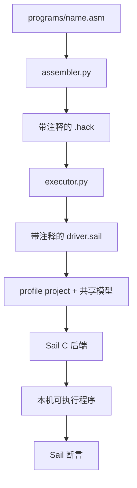

# 用 Sail 实现 Hack

`hack` ISA family 包含两个 profile：`hack16` 是 canonical 16 位 nand2tetris 基线，`hack32` 是 32 位 Verylogic 扩展。两者都保留 15 位 PC/地址和各 32768 word 的 ROM、RAM；模块在共享 Sail 语义之外配套汇编器、示例程序、源码断言和回归测试。

## 先运行一次

克隆仓库，进入根目录，然后执行：

```sh
git clone https://github.com/VIDLG/verylogic-workspace-sail.git
cd verylogic-workspace-sail
pixi run just hack list
pixi run just hack run multiply                    # 默认 hack16
pixi run just hack run multiply --profile hack32
```

程序成功时会输出 `ASSERT PASS` 和架构状态。[入门教程](/zh/hack/tutorial)会解释这些输出，并沿着同一个程序走完整条工具链。

## 按目标选择文档

| 想理解什么 | 阅读 |
| --- | --- |
| Hack、nand2tetris、NandGame 和 Sail 的关系，以及第一次运行 | [入门教程](/zh/hack/tutorial) |
| 寄存器、内存、指令位、ALU 运算和跳转 | [ISA 指南](/zh/hack/isa) |
| 怎样增加伪指令、工具、设备或真正的 ISA 扩展 | [进化 Hack](/zh/hack/evolution) |
| 符号、Hack+ 降级、两遍汇编和 `.hack` 输出 | [汇编器内部原理](/zh/hack/assembler) |
| 生成 driver、Sail C 后端、断言和测试 | [执行器与测试](/zh/hack/execution) |
| 精确命令、源码指令和产物注释级别 | [Hack 包参考](https://github.com/VIDLG/verylogic-workspace-sail/blob/main/isa/hack/README.zh-CN.md) |

## 一个程序的完整路径



机器契约由共享 `model/core.sail`、单一 `model/profiles/<profile>.sail` 入口和 `projects/<profile>.sail_project` 共同定义；assembler 翻译源码，executor 生成 driver 并完成本机编译，workflow 负责程序发现和命令分派。

## 建议学习顺序

1. 完成[入门教程](/zh/hack/tutorial)，并查看 `multiply.asm`。
2. 从一个 profile 入口进入其 include 的 `model/core.sail` 与 profile project，对照阅读 [ISA 指南](/zh/hack/isa)。
3. 通过[进化 Hack](/zh/hack/evolution)选择一个扩展，并先判断它属于哪一层。
4. 进入**工具链内部原理**，沿同一份源码继续阅读[汇编器](/zh/hack/assembler)。
5. 最后阅读[执行器与测试工作流](/zh/hack/execution)。
