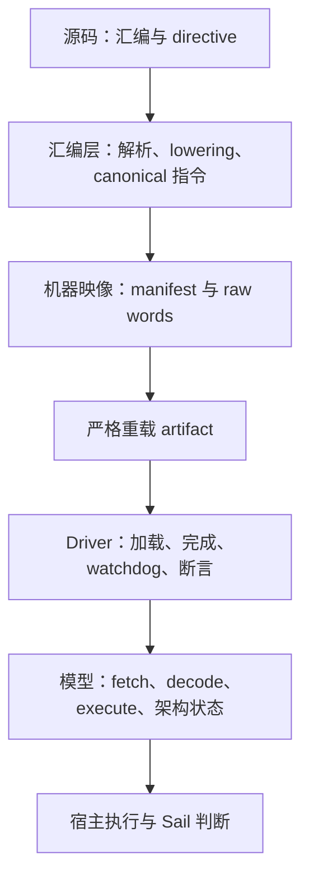

# 公共教学契约

[文档首页](/zh/) · [English](/reference/teaching-contract) · [Hack 汇编器](/zh/hack/assembler)

ISA 包共享一套小而明确的公共契约，用于源码 directive、运行配置解析、带注释机器映像身份、解释性注释和发布。每个 ISA 仍各自拥有指令语法、断言 target、编码、完成约定和 Sail 语义。

## 五层边界



| 层次 | 拥有什么 | 不应拥有什么 |
| --- | --- | --- |
| Source | 程序文本、`.description`、`.max_steps` 和 `.assert` | 编码机器字或生成 driver 策略 |
| Assembly | 源码位置、label、伪指令 lowering、canonical 指令和机器字 records | 最终架构状态或断言求值 |
| Machine image | raw words，以及文件开头 `//%` manifest 中的有效执行契约 | 隐藏 parser object 或未记录的 CLI override |
| Driver | raw word 加载、completion/watchdog 策略、断言和诊断输出 | decoded constructor、fetch/decode 语义或 ISA 状态转换 |
| Model | 架构存储、raw fetch、decode、execute、类型化 outcome 和组合 step 函数 | 源码发现、artifact 发布或程序专属 `main()` 策略 |

持久化机器映像是信任边界。Driver generation 只消费严格重载后的生成 artifact，不消费更丰富的内存 assembler result。

## 公共源码 directive

去掉 ISA 注释后，共享 parser 识别三种公共 directive：

```asm
.description 非空单行说明
.max_steps 1000
.assert TARGET == 42
.assert signed(TARGET) < 0
.assert unsigned(TARGET) >= 10
```

- `.description TEXT` 最多出现一次。内置程序 discovery 可以要求它存在，artifact 会保留它。
- `.max_steps POSITIVE_INT` 最多出现一次，提供运行配置解析中的 source 候选值。
- `.assert ...` 可以重复出现；它不产生指令，而是成为 manifest 中带源码位置的 assertion。

不属于这些形式的行继续由 ISA 拥有，因此公共 parser 不吸收汇编语法或伪指令。

## 断言语法与解释

### Equality 是 bit-exact

`==` 和 `!=` 比较 target 的架构位型，并要求 target 不带 wrapper：

```asm
.assert R0 == -1
.assert PC != 10
```

ISA 按 target 宽度校验数值，并把可接受的整数写法规范化为对应的无符号位型。Equality wrapper 会被拒绝，因为 signedness 不会改变位相等：

```asm
.assert signed(R0) == -1       // 非法
```

### Ordered comparison 必须显式指定 mode

`<`、`<=`、`>`、`>=` 必须说明怎样解释位型：

```asm
.assert signed(R0) < 0
.assert unsigned(PC) >= 10
```

公共 parser 负责 directive 形状、整数语法、拒绝 equality wrapper，以及 ordered comparison 的显式 mode 规则。Selected ISA 负责 target canonicalization、alias、宽度、范围、对齐和生成的 Sail expression。严格 artifact loading 会重复 ISA 校验，因此手工修改不能绕过源码检查。

## 运行配置：CLI > source > default

运行配置统一使用：

```text
CLI override > source directive > package default
```

严格重载前，最终值与来源都会序列化：

```lisp
(runtime (max-steps 2000 cli))
```

Driver 只读取重载后的有效值。CLI 状态不会绕过 image，作为隐藏 driver-generation 参数传递。

## 文件开头的 artifact manifest block

每份生成的带注释机器映像都以恰好一个连续的 `//%` manifest block 开头。Payload 是唯一 canonical restricted S-expression。`summary` 和 `full` 使用多行缩进 form，每一行都带前缀；`none` 把同一 form 压缩成一条带前缀的紧凑行。

```text
//% (artifact
//%   (schema "verylogic.annotated-image")
//%   (version 1)
//%   (isa hack)
//%   (profile standard)
//%   (source asm "programs/example.asm")
//%   (comments summary)
//%   (runtime (max-steps 1000 source))
//%   (assertions
//%     (assert (= R0 7) (source-line 12))
//%   )
//%   (completion lowered-self-loop word 12)
//%   (isa-metadata
//%     (object
//%       (address-bits 15)
//%       (ram-words 32768)
//%       (rom-words 32768)
//%       (word-bits 16)
//%     )
//%   )
//% )
```

它只是数据，不是可执行 Lisp 或 Sail。仓库 subset 允许 symbol、UTF-8 quoted string、十进制 integer 和 proper list；拒绝 float、reader abbreviation、dotted pair、vector、keyword、保留的 `nil`/`t`、重复或未知 field，以及非 canonical formatting。通用嵌套数据使用显式 `(object ...)`、`(array ...)` form 和 `none`、`true`、`false`。

公共 envelope 记录 schema/version、ISA/profile、安全 source identity、可选 description、comment level、解析后的 runtime value/origin、canonical assertion、可选非空 frontend provenance、completion metadata 和 ISA metadata。Pydantic model 校验精确的持久化形状；ISA artifact code 保留 profile 一致性、target canonicalization、地址有效性和 completion word 绑定等依赖上下文的检查。

## 解释档位：`none`、`summary`、`full`

Manifest 在每个档位都存在，只有人类解释改变：

| 档位 | 人类可读内容 |
| --- | --- |
| `none` | 一条紧凑 manifest 行后直接写 raw words |
| `summary` | 格式化 manifest、简洁 preamble，以及每个 word 一条有用的源码映射 |
| `full` | 在 summary identity 上增加 assertion 和逐 word provenance 细节 |

切换档位不得改变 words、assertions、runtime values、completion 或 ISA identity。

## Staging 与发布

单个生成映像使用同目录临时文件进行原子替换。多文件 artifact closure 使用 backup-and-replace 发布；安装失败时回滚。如果恢复本身无法完成，发布操作会报告明确的 incomplete-rollback 错误，并保留仍存在的 backup，而不是删除唯一可恢复副本。

完整 executor run 会在临时 sibling directory 中完成 assemble、strict reload、driver generation、Sail/host compile、staged native execution 和 Sail assertion 检查。只有 staged execution 成功才发布 machine image、driver、生成 C/header 和 executable。Assembly、loading、compilation、execution 或 assertion failure 都会保留上一次成功 closure。

这些是进程级 replacement/rollback 保证，不声称机器或文件系统故障下的 crash consistency。

## 共享机制，ISA 拥有策略

`tools/isa_support` 拥有 directive grammar、canonical manifest primitive、restricted S-expression parsing/rendering、进程执行、宿主编译和可回滚发布；它不导入任何 ISA。每个 ISA 包拥有汇编语法与 lowering、target validation、image-specific 检查、driver template、completion policy 和测试。
