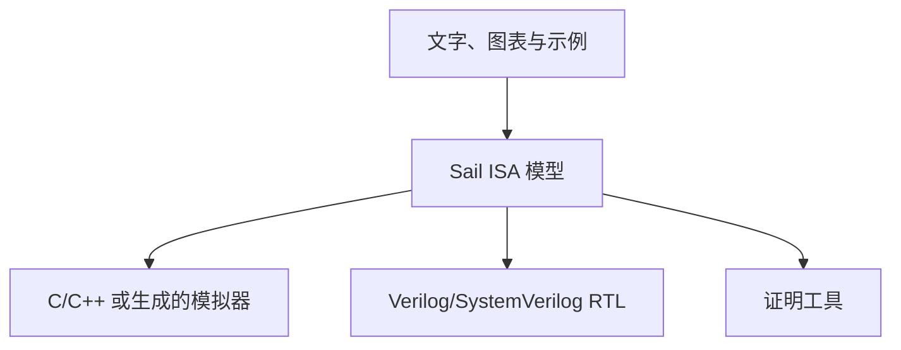

# 为什么这个工作区选择 Sail

[文档首页](/zh/) · [English](/why-sail) · [从 Hack 开始 →](/zh/hack/)

一条指令看起来只是“读几个值、算一下、再写回”。真正描述一套指令集时，事情很快就会变多：机器字怎样切成字段？每个字段多宽？使用旧状态还是新状态？运算怎样截断？异常何时发生？不同实现怎样判断自己做的是同一件事？

这些都是 ISA（指令集架构）本身的复杂度，不能删掉。问题在于，选错表达工具后，读者还要穿过另一层与 ISA 无关的复杂度，才能看到真正的机器规则。

> **Sail 不是让 ISA 本身变简单，而是让复杂度停留在 ISA 应有的地方。**

它保留指令编码、架构状态和状态转换，尽量不把宿主语言细节、某一种流水线或证明工程脚手架混进核心语义。对教学尤其重要：学生读到的大部分代码都在讲机器，而不是讲表达这台机器所用框架的内部机制。

## 先分清三个层次



这些表达方式不是互相淘汰的竞争者。问题是：**哪一种最适合成为中间那份、与具体实现无关的 ISA 事实来源？**

下面用一个很小的 Hack 例子和一个真实的 RISC-V 例子来看。

## 例一：Hack `AM=D` 应该写到哪个地址？

Hack 的 C 指令可以在一次执行中同时更新 `A`、`D` 和内存 `M`。例如：

```asm
AM=D
```

它把 `D` 写入 `A`，同时写入 RAM。容易忽略的规则是：RAM 地址必须使用**指令开始时的旧 `A`**，不能使用刚写入的新 `A`。

假设执行前：

```text
A = 100
D = 7
```

执行后应当是：

```text
A = 7
RAM[100] = 7
```

而不是 `RAM[7] = 7`。

### 只用文字：容易读，也容易漏掉一句

手册当然可以写：

> 如果同一条指令同时写入 A 和 M，M 使用指令开始时 A 的值作为地址。

这句话对学习不可缺少，但它不能自己运行。模拟器、RTL 和测试都必须再次手工实现这句话；其中任何一份漏读了“开始时”，就会产生第二种机器含义。

### 用 C/C++：赋值顺序会悄悄变成语义

下面是很自然、但对 Hack 来说错误的顺序代码：

```c
if (write_a) {
    cpu.A = out;
}
if (write_m) {
    cpu.ram[cpu.A & 0x7fff] = out; // 错误：这里读到的是新 A
}
```

修复并不难：先保存 `old_a`。但规范事实现在藏在临时变量、掩码和语句顺序里。除此之外，还要自行约定：

- `A` 是 16 位，而 RAM 地址只有 15 位；
- `out` 怎样截断；
- 解码器怎样产生 `write_a` 与 `write_m`；
- 编码器、反汇编器和模拟器怎样保持一致。

C/C++ 完全能把模拟器写对，但语言本身不知道这些代码是在表达 ISA，也不会替你检查这些关系。

### 用 Verilog/SystemVerilog：架构规则会被实现细节包围

RTL 中还会出现更多必须实现、但不属于 ISA 的内容：

```verilog
always_ff @(posedge clk) begin
  if (reset) begin
    A <= '0;
  end else if (execute_valid && !pipeline_stall) begin
    if (dest_a) A <= alu_out;
  end
end

assign ram_we    = execute_valid && dest_m;
assign ram_addr  = old_a[14:0];
assign ram_wdata = alu_out;
```

时钟、复位、有效信号、停顿、RAM 接口和流水级都是真实硬件问题，却不是 `AM=D` 的架构含义。另一颗无流水线或乱序执行的处理器会有不同 RTL，但必须给软件同样的结果。

RTL 适合回答“这颗处理器怎样实现”，不适合作为唯一来源回答“所有 Hack 处理器都必须做什么”。

### 用 Sail：代码几乎只剩机器规则

实际的 `hack.sail` 先保存旧状态，再明确写回：

```ocaml
let old_a = A;
let out = alu(comp, D, y);

if dest[2] == 0b1 then A = out else ();
if dest[1] == 0b1 then D = out else ();
if dest[0] == 0b1 then RAM[unsigned(ram_address(old_a))] = out else ();
```

相关类型也直接写在模型里：

```ocaml
type word = bits(16)
type address = bits(15)

register A : word
register RAM : vector(32768, word)
```

这里仍有复杂度，但几乎每一行都在回答 ISA 问题：旧值是什么、结果是什么、写哪些目标、地址多宽。没有时钟和流水线，也不需要靠 C 的掩码约定来暗示类型。

## 例二：RISC-V `ADDI` 不只是“一次加法”

RISC-V 的 `ADDI` 常被概括为：

```text
x[rd] = x[rs1] + immediate
```

真正的架构规则还包括：

1. 指令是 32 位，立即数来自 `inst[31:20]`；
2. 立即数只有 12 位，需要符号扩展到当前 XLEN；
3. `rs1` 和 `rd` 都是 5 位寄存器编号；
4. 结果按 XLEN 位运算并保留低 XLEN 位；
5. 读 `x0` 总是得到零，写 `x0` 必须被忽略；
6. `funct3` 和 opcode 必须匹配 `ADDI` 编码。

一句“加立即数”很容易读，以上细节才构成可执行、可测试的 ISA。

### 在 C/C++ 中：需要用约定重新搭一套位级语言

一个解释器分支可能长这样：

```c
uint32_t rd  = (insn >> 7)  & 0x1f;
uint32_t rs1 = (insn >> 15) & 0x1f;
uint_xlen_t imm = sext12(insn >> 20);
uint_xlen_t result = cpu.x[rs1] + imm;

if (rd != 0) {
    cpu.x[rd] = result;
}
```

它可以正确运行，但很多 ISA 信息依赖项目自定义约定：

- `uint_xlen_t` 到底是 32 位还是 64 位；
- `sext12` 是否对所有边界值正确；
- `cpu.x[0]` 是否始终保持零；
- opcode 与 `funct3` 的检查写在什么地方；
- 编码器是否使用与解码器完全相反的位操作。

为了得到完整规范，项目通常还要维护编码表、解码器、执行器、反汇编器和测试。难点不是 C 写不了，而是**同一条架构事实被拆散后，要靠工程纪律保持同步**。

### 在 RTL 中：还要选择一种处理器组织方式

同一个 `ADDI` 进入 RTL 后，需要决定它在哪一级解码、立即数在哪一级扩展、何时读取寄存器、如何旁路、何时提交、遇到停顿或清空时怎么办。这些都是构建处理器必须回答的问题，但 RISC-V ISA 并没有要求只有一种答案。

如果用某一颗核心的 RTL 充当 ISA 规范，学生首先看到的往往是流水线控制，而不是 `ADDI` 的编码和架构效果。

### 在 Sail 中：编码、类型和执行语义共享同一种语言

Sail 项目的 RISC-V 示例先定义指令形式，再把它与 32 位机器字连接：

```ocaml
union clause ast = ITYPE : (bits(12), regbits, regbits, iop)

mapping clause encdec =
  ITYPE(imm, rs1, rd, op)
    <-> imm @ rs1 @ encdec_iop(op) @ rd @ 0b0010011
```

执行语义继续使用相同的 `imm`、`rs1`、`rd` 和 `op`：

```ocaml
function clause execute (ITYPE (imm, rs1, rd, op)) = {
  let rs1_val = X(rs1);
  let immext : xlenbits = EXTS(imm);
  let result : xlenbits = match op {
    RISCV_ADDI => rs1_val + immext,
    /* 其他 I-type 运算 */
  };
  X(rd) = result;
  true
}
```

这段代码仍需要周边模型定义 `xlenbits`、`X` 和 `EXTS`；区别是这些抽象都在 ISA 类型与状态体系内：

- `bits(12)` 明确了立即数宽度；
- `xlenbits` 明确结果随 XLEN 变化；
- `EXTS` 明确这是符号扩展；
- `X` 集中实现包括 `x0` 在内的架构寄存器规则；
- `encdec` 把指令结构与机器编码放在可检查的关系中。

读者看到的主要仍是 RISC-V，而不是宿主语言或某颗核心的组织方式。

## 两个例子说明了什么

Hack 和 RISC-V 的规模差别很大，但问题相同：一份 ISA 规范要把**机器字、类型、状态和行为**保持一致。

| 表达方式 | 作为 ISA 主规范时额外出现的工作或噪音 |
| --- | --- |
| 自然语言与表格 | 必须另写可执行模型；歧义、交叉引用和实现漂移只能靠评审与测试发现 |
| C/C++ | 宿主整数、掩码、转换、辅助函数和控制流会包围 ISA 规则；编码与解码通常分开维护 |
| Python/Rust 或自定义 DSL | 可以更简洁，但项目仍需自行建设 ISA 类型、检查器、后端和形式化接口 |
| Verilog/SystemVerilog | 时钟、复位、流水线、握手、转发、缓存和接口属于具体实现，不属于 ISA 本身 |
| Coq、Isabelle、Lean、HOL | 可以最严格地证明性质，但初学者在运行第一条指令前就要进入证明语言、库和证明工程 |
| Sail | 仍要学习专用语法和工具链，但核心代码大多直接对应编码、架构状态与指令语义 |

所以 Sail 的优势不是“代码一定最短”，而是**ISA 信息密度高、与目标层次无关的噪音少**。

## 为什么这对教学重要

教学模型不只要得到正确结果，还要让学生能回答“为什么”。

- 从 `bits(12)` 能直接看到立即数宽度，而不是从 `0xfff` 掩码反推；
- 从 `old_a` 能直接看到旧状态规则，而不是猜测 C 赋值顺序；
- 从 `mapping` 能把教材编码表与解码规则放在一起读；
- 修改模型后可以马上类型检查、生成 C 并运行测试；
- 同一份语义将来还能连接 RTL 对照或形式化工具。

这形成一条适合学习的路径：

```text
读懂规则 → 修改规则 → 运行规则 → 用测试观察后果
```

## 选择 Sail 不意味着排斥其他语言

本工作区仍然按问题选择工具：

| 问题 | 合适的表达方式 |
| --- | --- |
| 人怎样学习和查阅架构 | 文字、图表和示例 |
| 每条指令对软件究竟意味着什么 | Sail ISA 模型 |
| 汇编语法、标签和伪指令怎样处理 | Python assembler |
| 怎样得到本机可执行参考模型 | Sail C 后端与宿主 C 编译器 |
| 处理器逐周期怎样实现 | Verilog/SystemVerilog 等 HDL |
| 怎样证明安全性或正确性定理 | Sail 的形式化后端或直接使用证明助理 |

Sail 也有成本：它是专用语言，生态与编辑器支持小于 C/C++ 或 SystemVerilog；大型模型和某些后端仍需要专业知识。它不是 RTL，不是周期精确模拟器，类型检查也不等于正确性证明。

这里选择 Sail 的原因更具体：**这个工作区首先要教授和执行 ISA，而 Sail 能让学生把注意力放在 ISA 上。**

## 延伸阅读

- [继续看 Hack 模型与完整执行路径 →](/zh/hack/tutorial)
- [Sail 项目与 RISC-V 示例](https://github.com/rems-project/sail)
- [Sail RISC-V 模型](https://github.com/riscv/sail-riscv)
- [Sail Language Reference](https://alasdair.github.io/manual.html)
- [Detailed Models of Instruction Set Architectures: From Pseudocode to Formal Semantics](https://doi.org/10.1145/3290384)
