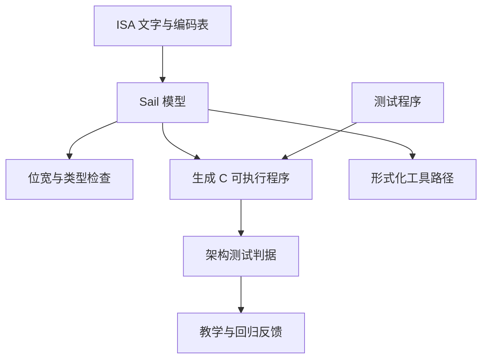

# 为什么这个工作区选择 Sail

[文档首页](/zh/) · [English](/why-sail) · [从 Hack 开始 →](/zh/hack/)

指令集架构是软件与处理器实现之间的契约。它规定指令编码、架构状态，以及每条指令引起的状态转换；但它不规定唯一的流水线、电路、模拟器或证明方法。

Sail 很适合处在这条边界上：它足够精确，可以运行和检查；表述方式又接近 ISA 手册中的伪代码与编码表。因此，本工作区用 Sail 作为 ISA 行为的事实来源，同时让汇编器、程序 driver、生成的 C 和硬件实现各自留在正确的层次。

## 一份 ISA 描述需要做到什么

对本工作区而言，有用的 ISA 描述应当：

1. 明确表达指令位和固定位宽值；
2. 描述架构效果，但不绑定某一种微架构；
3. 适合教学、阅读与评审；
4. 能作为参考模型执行，而不只是静态文字；
5. 让测试直接复用读者看到的同一份语义；
6. 能通向代码生成和形式化工具，而不必再手写另一份模型。

没有一种表示能在所有维度上取胜。Sail 适合作为本项目的中心，是因为它能同时覆盖这六项需求。

## 其他表达方式解决的是不同问题

| 表达方式 | 最擅长 | 单独作为 ISA 事实来源时的缺口 |
| --- | --- | --- |
| 自然语言与编码表 | 发布容易阅读和查阅的架构手册 | 歧义和遗漏无法直接执行，示例与实现可能逐渐偏离 |
| C/C++ 参考模拟器 | 高速执行、调试器与设备生态、生产级模拟 | ISA 结构、位宽和编码关系往往依赖约定与辅助函数，而不是语言本身的模型 |
| Verilog/SystemVerilog 等 HDL | RTL、时钟、流水线、接口、综合和实现验证 | 软件可见行为会与微架构细节混在一起，而同一 ISA 可以有很多种实现 |
| 临时编写的 Python/Rust/DSL 模型 | 快速原型和项目专属集成 | 项目需要自行维护 ISA 类型、检查、文档和分析工具生态 |
| Coq、Isabelle、Lean、HOL | 机器检查的定义与深入证明 | 对只想先运行和理解 ISA 的读者，证明工程的进入成本较高 |
| Sail | 可执行、强类型的 ISA 语义和可复用后端 | 它本身不是 RTL、周期精确模拟器，也不自动构成证明 |

这里比较的是它们对 **ISA 这一层**的适配程度，不是宣称 Sail 在所有场景下都优于其他语言。

## 与 Verilog/SystemVerilog 相比

HDL 描述的是一种硬件实现：寄存器如何在时钟沿更新、组合路径、流水级、停顿、总线和实现接口。这些内容对造出处理器非常重要，但有意处在 ISA 契约的下层。解释器、顺序核和乱序核可以实现完全相同的指令行为。

如果只用 RTL 充当架构规范，通常有两个问题：

- 一条指令的含义散落在解码、流水线、转发、异常与提交逻辑中；
- 某个实现的选择容易被误认为所有实现都必须遵守的架构要求。

Sail 可以把一条指令写成一次完整的架构状态转换。它的 `mapping` 能把编码和解码放在一起，固定位宽 bitvector 则让字段宽度进入可检查的模型。RTL 随后可以与这份独立参考模型进行对照验证。

二者是互补关系，不是替代关系。用 Verilog/SystemVerilog 回答**这颗处理器怎样实现、怎样按周期工作**；用 Sail 回答**任何兼容处理器必须让软件观察到什么**。在 Hack 学习路径中，nand2tetris HDL 仍然适合学习门和芯片；`hack.sail` 从紧接着的抽象边界开始。

## 与 C/C++ 相比

手写 C/C++ 模拟器可以很快，也容易接入成熟的操作系统、调试器和设备基础设施。它常常是正确的实现产物，但把它当作首要规范会遇到一些困难：

- 固定位宽关系和 signedness 需要严格遵守宿主语言类型与辅助函数约定；
- 解码与编码通常是两套函数，需要人为保证一致；
- 优化、缓存、设备和控制流可能遮住真正要说明的架构规则；
- 文字手册、模拟器和形式化模型可能演变为三份独立维护的 ISA 含义。

Sail 把这些问题放进面向 ISA 的语言中。数值和 bitvector 宽度参与类型检查，指令形式是明确的数据结构，双向 mapping 可以连接结构与机器字；同一模型随后还能生成 C 运行。换言之，本工作区仍然享受 C 作为运行目标的优势，但不把手写 C 当作语义来源。

生成的 C 并不一定满足所有生产级模拟器的性能要求，也不会自动提供 CPU 之外的完整系统。当首要需求是吞吐量、时序模型、二进制翻译或大规模设备生态时，经过优化的 C/C++ 模拟器仍然更合适。

## 与自然语言和伪代码相比

自然语言比源码更适合解释动机、例外和设计意图，编码图表也非常适合查阅；文档仍然不可缺少。

但它们不适合单独充当测试判据。“旧寄存器值”、溢出行为、合法字段宽度和多个效果的先后关系，都可能被不同实现者作出不同解释。厂商伪代码改善了结构，但只有在语言及其工具被精确定义后，才能成为可靠的可执行标准。

Sail 不是要删除文字说明，而是给它配上一份可执行的语义：读者可以检查紧凑的状态转换，类型检查器可以拒绝不一致的位宽，测试可以运行完全相同的转换。文档负责解释模型，不应悄悄变成第二份模型。

## 与证明助理相比

当主要目标是机器检查的证明时，直接在 Coq、Isabelle、Lean 或 HOL 中定义 ISA 是很强的基础。但在贡献者运行第一个程序或修改第一条指令之前，它也可能要求较多证明语言和库知识。

Sail 位于一个务实的中间位置：表层语言面向架构工程师，模型可以执行，工具链还能为定理证明后端生成定义。这为“工程师可读的模型 → 形式化推理”提供了一条路径。

边界必须说清楚：类型检查不等于证明 ISA 正确，生成定理证明器定义也不等于证明已经完成；本工作区目前不声称 Hack 模型已经过形式化验证。

## Sail 为什么适合这个工作区

Hack 模型展示了未来 ISA 模块也应保留的性质：

- **代码接近机器契约。** 指令形式、编码、寄存器和状态转换直接可见，不藏在框架机制中。
- **位级错误可以被检查。** `bits(n)` 和相关数值约束能表达一般语言注释无法强制的事实。
- **同一模型既可读又可运行。** C 后端把读者检查的语义直接变成测试所用的可执行程序。
- **测试在 Sail 中判断架构状态。** Python 负责协调工具，但不会重新实现一遍 Hack 执行。
- **模型不依赖单一实现。** 同一语义可以服务教学、软件早期适配、RTL 对照和未来的形式化工作。
- **它不只适用于玩具 ISA。** Sail 项目发布了面向 RISC-V、Arm 衍生模型、MIPS、x86 片段和多种 CHERI 架构的模型与工具。

## 选择 Sail 不意味着什么

选择 Sail 不代表所有文件都应改用 Sail，也不代表所有抽象层都应挤进 ISA 模型。

| 本工作区中的问题 | 负责者 | 原因 |
| --- | --- | --- |
| 指令编码与架构状态转换 | Sail 模型 | 这是 ISA 契约 |
| 汇编语法、标签与伪指令降级 | Python assembler | 这些属于源语言层 |
| 程序加载、运行边界与生成的 `main()` | Executor 与 Sail driver | 它们随程序和平台变化 |
| 本机编译 | Sail C 后端与宿主 C 编译器 | C 是执行目标，不是第二份手写 ISA |
| 门、时序与流水线 | 将来需要时使用 HDL 项目 | 这些属于实现层 |
| 解释与学习顺序 | 文档 | 文字负责教授意图和上下文 |

Sail 也有真实成本：它是专用语言，生态小于 C/C++ 或 SystemVerilog，编辑器支持不够成熟，某些后端或大型模型需要专门知识。本仓库通过固定 Sail 版本和封装常用任务来降低安装成本，但不应隐藏这些取舍。

## 一个实用的选择规则

先看你需要回答的问题，再选择主要表达方式：

- **每种实现上的一条指令都必须具有什么含义？** 从 Sail 开始。
- **怎样让人学习或查阅架构？** 在 Sail 模型旁编写文字与图表。
- **这颗处理器逐周期怎样实现？** 使用 HDL。
- **怎样运行高度优化的全系统模拟器？** 使用模拟器框架或优化的 C/C++，并可把 Sail 模型作为判据。
- **怎样证明安全性或正确性定理？** 适合时使用 Sail 的形式化后端；若直接在证明助理中建模更利于证明工程，也应选择后者。

这个教学工作区的中心问题是第一项。因此 Sail 位于中央，其他表达方式围绕它连接，而不是被当成需要消灭的竞争者。

## 延伸阅读

- [Sail 项目与能力概览](https://github.com/rems-project/sail)
- [Sail Language Reference](https://alasdair.github.io/manual.html)
- [Detailed Models of Instruction Set Architectures: From Pseudocode to Formal Semantics](https://doi.org/10.1145/3290384)
- [继续看这些选择怎样用于 Hack →](/zh/hack/tutorial)
